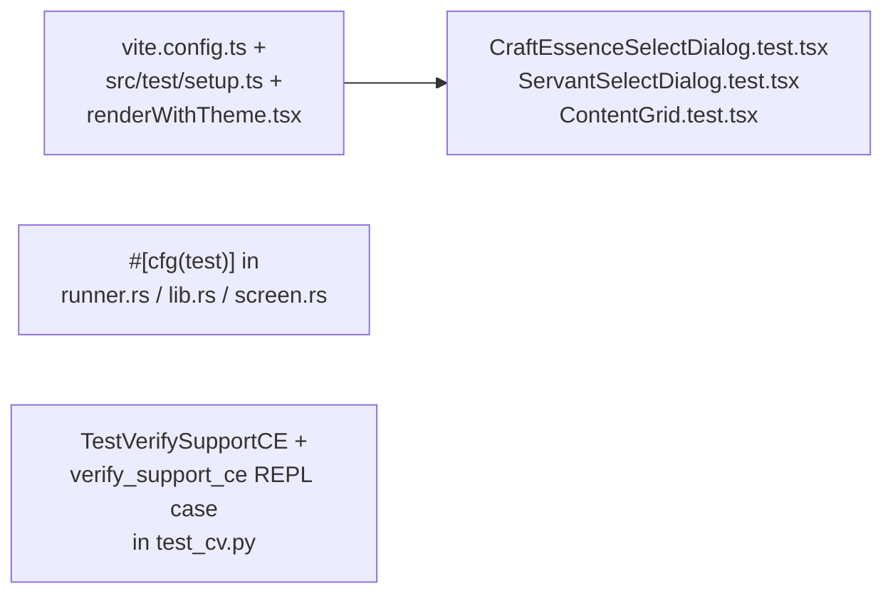

## 1. Python sidecar — extend existing pytest suite

File: [sidecar/mash_cv/tests/test_cv.py](sidecar/mash_cv/tests/test_cv.py).

Add a new `TestVerifySupportCE` class plus one REPL case in `TestREPL`. Reuse the `_clear_state` autouse fixture and add a teardown line for the new cache:

```python
from mash_cv import cv as _cv_module
_cv_module._ce_template_cache.clear()
```

Tests (all synthetic — no real CE PNG required, since `src-tauri/assets/ces/` is gitignored):

- `test_returns_zero_for_empty_image` — passes `np.zeros((0, 0, 3))` → `{score: 0.0, passed: False, error: "empty image"}`.
- `test_returns_error_when_template_missing` — valid image, `template_path="/nonexistent.png"` → `score=0.0, passed=False, error contains "not readable"`.
- `test_passes_when_template_embedded_in_region` — build a 2560×1440 BGR image, paint a `_gradient_patch`-style icon at the expected `CE_ICON_W_FRAC × CE_ICON_H_FRAC` pixel size into a known row rect, write the same patch (with framing strip) to a tmp PNG, call `_verify_support_ce` with the matching region → `passed=True`, `score > 0.95`.
- `test_fails_when_template_mismatched` — same image but write a different pattern as the template → `passed=False`, `score < threshold`.
- `test_load_ce_template_caches` — call `_load_ce_template(path, w, h)` twice → identical ndarray identity (`a is b`); call with a different `target_w` → new array.
- `test_load_ce_template_drops_alpha_and_crops_frame` — write a 150×68 RGBA template with distinct top/bottom strips, assert the loaded shape == requested `(target_h, target_w)` and the cropped band excludes the strips (sample a pixel value).
- New REPL case `test_verify_support_ce_command` in `TestREPL` — drive the sidecar via stdin with `{"cmd":"verify_support_ce", ...}` and assert the response carries `score` + `passed`.

## 2. Rust backend — introduce `cargo test`

No tests exist today. Add `#[cfg(test)] mod tests { ... }` blocks at the bottom of the relevant modules so `cargo test --manifest-path src-tauri/Cargo.toml` works out of the box (no new dev-deps required — `serde_json` is already in `[dependencies]`).

### [src-tauri/src/runner.rs](src-tauri/src/runner.rs) — CE math + RunConfig serde

- `support_ce_search_region` is currently an `impl Runner` associated fn. Either keep the test on a re-exported `pub(crate)` thin wrapper, or move the pure math into a free fn `fn ce_search_region(row: NormRect) -> NormRect` and have the method call it. Tests then assert: identity row → `SUPPORT_CE_OFFSET_IN_ROW`; offset row at `(0.1, 0.2, 0.5, 0.5)` → expected `(0.12, 0.475, 0.05, 0.20)`.
- `RunConfig` deserialization: round-trip a JSON without `supportCraftEssenceId` and assert `support_craft_essence_id == None`; round-trip with `"supportCraftEssenceId": 1485` and assert `Some(1485)`.

### [src-tauri/src/lib.rs](src-tauri/src/lib.rs) — project + CE catalog

- `default_project_slots()` — assert length 6, ids `slot-0..slot-5`, slot 2 is `support`, all `craft_essence_id == None`.
- `ProjectSlot` legacy deserialization — JSON `{"id":"slot-0","type":"servant","servantId":284}` (no `craftEssenceId`) → `craft_essence_id == None`; JSON with `"craftEssenceId": 1485` → `Some(1485)`.
- `craft_essences_data()` — assert `len() > 0`, every entry has non-empty `name`, ids are unique (`HashSet`).

### [src-tauri/src/screen.rs](src-tauri/src/screen.rs) — IPC payload helper

- `add_image_path` — pure JSON helper. Given `{"cmd":"detect"}` + `Some(Path::new("/tmp/x.png"))` → result `imagePath` field is `"/tmp/x.png"`. With `None` → no `imagePath` key.

(Skip anything that needs a live `Sidecar` subprocess or `tauri::AppHandle`; that already has coverage via the Python REPL tests and dev-mode runs.)

## 3. Frontend — set up vitest + RTL

### Tooling

- Add devDeps via `pnpm add -D`: `vitest`, `@vitest/ui`, `@testing-library/react`, `@testing-library/user-event`, `@testing-library/jest-dom`, `jsdom`.
- Replace `vite.config.ts` `defineConfig` import with `defineConfig` from `vitest/config` and add a `test` block:
  - `environment: "jsdom"`, `globals: true`, `setupFiles: ["./src/test/setup.ts"]`, `css: true`.
- Add scripts to [package.json](package.json):
  - `"test": "vitest run"`, `"test:watch": "vitest"`.
  - Update `"build"` to keep current behaviour (lint + tsc + vite build); do **not** wedge tests in to avoid blocking `tauri build`.
- New `src/test/setup.ts`: imports `@testing-library/jest-dom/vitest` and stubs `@tauri-apps/api/core` with `vi.mock` so `invoke()` is a `vi.fn()` returning sensible defaults (e.g. `[]` for `get_servants` / `get_craft_essences`). Centralizing the mock keeps component tests Tauri-shell-free.
- `tsconfig.json` — add `"types": ["vitest/globals", "@testing-library/jest-dom"]` to `compilerOptions` (or a `tsconfig.test.json` if we want to keep the production tsconfig untouched — confirm by inspecting the existing tsconfig before editing).

### Component tests (Radix `<Theme>` wrapper helper)

Add `src/test/renderWithTheme.tsx` that wraps the tree in `<Theme>` (from `@radix-ui/themes`) before passing to RTL `render`, mirroring how `main.tsx` wraps the app.

- `src/components/CraftEssenceSelectDialog.test.tsx` — primary new-feature coverage:
  - Renders with a fixed CE list `[{id:1, name:"Kaleidoscope"}, {id:2, name:"Black Grail"}, ...]`, `open={true}`.
  - Typing in the search field filters rows ("kal" leaves Kaleidoscope only).
  - Empty results show "未找到匹配的礼装".
  - Arrow-down + Enter selects via keyboard → asserts `onSelect` called with the focused CE and `onOpenChange(false)`.
  - Clicking a row calls `onSelect`.
  - Closing the dialog clears the search input on next open.
  - Virtualization sanity: render 500 CEs, query `screen.queryAllByRole("option")` → result is far less than 500 (only mounted rows).
- `src/components/ServantSelectDialog.test.tsx` — sibling smoke test (search filter + onSelect) so the existing dialog also has a regression net.
- `src/components/ContentGrid.test.tsx` — light smoke test: render with 6 default slots and an empty servant/CE list, assert the 6 CE pickers show the "选择礼装" placeholder and that clicking one opens the dialog (assert by role `dialog` appearing). Drag-and-drop is out of scope (dnd-kit is awkward to drive headlessly).

## 4. CI / repo glue

- Update [AGENTS.md](AGENTS.md) "Development Commands" section with the new commands so future agents know the surface:
  - `pnpm test` — frontend (vitest run).
  - `cargo test --manifest-path src-tauri/Cargo.toml` — Rust unit tests.
  - `poetry run pytest` — sidecar (already documented).
- Do **not** introduce a CI workflow file unless one already exists (none was in the repo as of this plan).

## File summary



## Out of scope

- Any test that requires a live ADB device, scrcpy stream, or PyInstaller-bundled sidecar.
- End-to-end Tauri tests (no WebDriver setup today; would be a separate plan).
- Drag-and-drop interaction tests (dnd-kit + jsdom is brittle; covered by manual QA).
- Bundling real CE PNGs into the test fixtures (`src-tauri/assets/ces/` is gitignored; sidecar tests use synthetic templates).