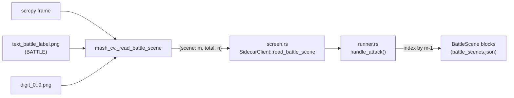

## Mental model

Inspecting [`sidecar/mash_cv/tests/test_data/screenshots/battle.png`](sidecar/mash_cv/tests/test_data/screenshots/battle.png) confirms the HUD layout: three rows in the top-right corner.

- `BATTLE  1/3` — current battle scene m of total n (what the user actually configures against)
- `ENEMY   残り3体`
- `TURN    1ターン` — in-game turn counter (already read by `_read_turn`, but semantically wrong for picking config)

The fix is to detect `m/n` next to `BATTLE` and use `m` (1-indexed) as the index into the saved config blocks. The existing `_read_turn` path is dead weight after this — remove it along with `text_turn_label` / `text_tan` references in the template loader (the PNGs themselves can stay on disk, but stop loading by name).



## CV layer — `sidecar/mash_cv/mash_cv/cv.py`

- Add `_read_battle_scene(img, region) -> {"scene": int|None, "total": int|None}`. Same recipe as [`_read_turn`](sidecar/mash_cv/mash_cv/cv.py) (lines 318-388) but:
  - Left anchor: `text_battle_label` (only). No right anchor — search the strip from the right edge of the BATTLE label all the way to the end of `region`.
  - The user's region `{x: 0.595, y: 0.004, w: 0.092, h: 0.057}` covers only the BATTLE word itself; the function needs more horizontal room to also see `m/n`. Use a wider strip in the runner constant (see below) and let the function use the entire ROI.
  - Match `digit_0..9` inside the strip, run the same greedy x-NMS as `_read_turn`, then split the kept detections into two groups by the **single largest x-gap** between adjacent digits (must be larger than ~0.5x average glyph width, otherwise return `total=None`). Left group = `scene`, right group = `total`.
  - Return `{"scene": None, "total": None}` if the BATTLE anchor misses or fewer than 2 digits clear threshold.
- Wire dispatcher: add `elif action == "read_battle_scene":` in the command loop (around [cv.py:1498](sidecar/mash_cv/mash_cv/cv.py)) returning the new shape.
- **Delete** `_read_turn` and its `read_turn` dispatcher branch. Remove `_read_turn` from [`mash_cv/__init__.py`](sidecar/mash_cv/mash_cv/__init__.py)'s exports (lines 21, 60).
- Update the protocol docstring header (lines 9-46): swap `read_turn` line for `read_battle_scene`.

## CV layer — `sidecar/mash_cv/tests/test_cv.py`

- Replace `class TestReadTurn` (lines 312-370) with `class TestReadBattleScene`:
  - `test_returns_none_when_anchor_missing` — blank image -> `{"scene": None, "total": None}`.
  - `test_battle_screenshot_reads_one_of_three` — `battle.png` -> `{"scene": 1, "total": 3}`.
  - `test_np_overlay_returns_none` — `battle_np.png` -> both None (BATTLE row covered by NP splash).
  - Drop `test_six_turn_screenshot_reads_six` (turn_six.png is a TURN N=6 capture, not a scene capture).
- Update `TURN_REGION` constant -> `BATTLE_SCENE_REGION = {"x": 0.587, "y": 0.0, "w": 0.108, "h": 0.062}` (label region widened rightward to capture `m/n`; mirror the Rust constant).

## Templates — `src-tauri/resources/templates/`

- `text_battle_label.png` already added by the user.
- Mirror it under `sidecar/mash_cv/tests/test_data/templates/text_battle_label.png` so the sidecar tests keep working with the pruned template dir.
- Optionally delete the unused `battle copy.png` showing in `git status` (stray file).
- Stop referencing `text_turn_label.png` and `text_tan.png` from code — the files can stay on disk (don't ship-affecting) but won't be loaded by name. Document this in [`src-tauri/resources/README.md`](src-tauri/resources/README.md).

## Rust IPC layer — `src-tauri/src/screen.rs`

- Replace `SidecarClient::read_turn` ([screen.rs:737-756](src-tauri/src/screen.rs)) with:

```rust
pub fn read_battle_scene(
    &mut self,
    image_path: Option<&Path>,
    region: NormRect,
) -> Result<Option<(u32, u32)>, String> {
    let mut req = serde_json::json!({
        "cmd": "read_battle_scene",
        "region": { "x": region.x, "y": region.y, "w": region.w, "h": region.h },
    });
    Self::add_image_path(&mut req, image_path);
    let resp = self.send_recv(&req)?;
    let scene = resp["scene"].as_u64().map(|n| n as u32);
    let total = resp["total"].as_u64().map(|n| n as u32);
    Ok(scene.zip(total))
}
```

## Rust runner — `src-tauri/src/runner.rs`

- Rename `TURN_REGION` -> `BATTLE_SCENE_REGION` and widen it: `NormRect { x: 0.587, y: 0.0, w: 0.108, h: 0.062 }` (covers BATTLE word + `m/n`, slightly above where the old TURN strip sat).
- In `debug_coordinates` (lines 277-285), rename the group: `id: "battleScene"`, `label: "战斗场景"`, region label `"BattleSceneRegion"`.
- Rename struct fields in `BattleState` (lines 366-389):
  - `current_turn` -> `current_scene_index` (still 0-based into the config Vec)
  - `last_screen_turn: Option<u32>` -> `last_screen_scene: Option<u32>` (the `m` value)
- In the attack handler (around lines 1260-1307):
  - Call `self.sidecar.read_battle_scene(None, BATTLE_SCENE_REGION)`; destructure `(m, n)`. Use `m` as the screen-side scene id.
  - Advance `current_scene_index` when `m` differs from `last_screen_scene` (same edge-trigger logic as the old turn change, minus the special-case for the very first detection — keep that intact).
  - Update emitted Chinese strings: `"等待行动回合…"` -> `"等待战斗动作…"`, `"回合变更 → ..."` -> `"场景变更 → 执行第 {} 组指令 (画面场景: {}/{})"`, `"回合未变更，直接攻击"` -> `"场景未变更，直接攻击"`, `"无第 {} 组指令配置..."` keeps the same shape.
- Update import + struct rename: `use crate::{..., BattleScene}` and `turns: Vec<BattleScene>` everywhere (lines 6, 543, 593). Method `execute_turn_skills(&self, turn: &Turn)` becomes `execute_scene_skills(&self, scene: &BattleScene)` (line 1559).

## Rust types & commands — `src-tauri/src/lib.rs`

- Rename `pub struct Turn` -> `pub struct BattleScene` (lines 47-56). Field names stay (`servant_actions`, `equipment_actions`, `attack_priority`) so on-the-wire JSON shape is unchanged for individual blocks.
- Rename file path helper `project_turns_path` -> `project_battle_scenes_path`, with new filename `battle_scenes.json` ([lib.rs:142-146](src-tauri/src/lib.rs)).
- Rename Tauri commands `save_turns` -> `save_battle_scenes`, `load_turns` -> `load_battle_scenes` ([lib.rs:209-223](src-tauri/src/lib.rs)). Param/local renames: `turns` -> `scenes`.
- **One-shot migration** inside `load_battle_scenes`: if `battle_scenes.json` does not exist but a sibling `turns.json` does, read it, deserialize as `Vec<BattleScene>` (compatible — same JSON), write to the new path, remove the old file, then return the parsed vec. This way no user data is lost on upgrade.
- Update the `invoke_handler![...]` registration list (lines 706-707) to the new command names.

## Frontend types & components

- Rename [`src/types/command.ts`](src/types/command.ts)'s `Turn` interface -> `BattleScene` (keep the field names — they match the Rust serde rename).
- Rename file `src/components/TurnBlock.tsx` -> `src/components/BattleSceneBlock.tsx`. Inside:
  - Rename `TurnBlock`, `TurnBlockProps`, prop `turn` -> `scene`, `onChange: (updated: BattleScene) => void`.
  - Header label (line 367-369): `Turn {index + 1}` -> `场景 {index + 1}` (Chinese, matching the project's UI-language convention in AGENTS.md).
- Update [`src/components/CommandEditor.tsx`](src/components/CommandEditor.tsx):
  - Imports: `BattleSceneBlock`, `BattleScene`.
  - State: `scenes: BattleScene[]`. Helpers: `createDefaultScene`, `createSceneId`.
  - `invoke<BattleScene[]>("load_battle_scenes", { projectId })` and `invoke("save_battle_scenes", { projectId, scenes: updated })`.
  - "+ Add New Turn" button -> "+ 添加新场景".
- Update [`src/App.css`](src/App.css) — rename `.turn-block` -> `.scene-block`, `.turn-header` -> `.scene-header`, `.turn-action-btn*`, `.turn-delete-btn`, `.add-turn-btn` -> matching `scene-*` / `add-scene-btn`. Update the section comments (`/* ── Turn Block ── */` -> `/* ── Battle Scene Block ── */`, etc.).
- Update [`src/test/setup.ts`](src/test/setup.ts) line 48: `case "load_battle_scenes":`.

## Frontend tests

- Spot-check `src/components/__tests__/*.test.tsx` for any `load_turns` / `save_turns` / `Turn` / `TurnBlock` references and rename to the new names. Existing tests don't appear to mount `CommandEditor` directly, but verify with a final `pnpm test` pass.

## Docs

- Update [`AGENTS.md`](AGENTS.md):
  - Line 23 description: `screen.rs` no longer mentions `read_turn` — change to `read_battle_scene`.
  - Line 177: replace the turn-OCR template paragraph with a battle-scene OCR description: `(text_battle_label, digit_0..digit_9) is looked up by name directly by _read_battle_scene`.
- Update [`README.md`](README.md) line 27 similarly.
- Update [`sidecar/mash_cv/README.md`](sidecar/mash_cv/README.md) protocol section and any `_read_turn` references.

## Verification (per the test-first expectation in AGENTS.md)

Cross-layer change, so all three suites:

```bash
cd sidecar/mash_cv && poetry run pytest                # new TestReadBattleScene + drops dead read_turn
cargo test --manifest-path src-tauri/Cargo.toml        # struct rename + serde shape
pnpm test                                              # mock command rename + UI rename
```