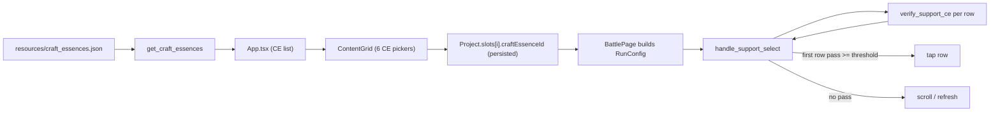

## Goal

1. Replace the 6 decorative `ImageCard` placeholders below the team-builder slots in [src/components/ContentGrid.tsx](src/components/ContentGrid.tsx) with CE pickers; persist each slot's `craftEssenceId` on the project.
2. When the runner's `handle_support_select` picks a row, verify that the row's CE icon matches the CE pinned on the **support** slot (other 5 are stored only — future work).

## Frontend

### Types and IPC

- `[src/types/craftEssence.ts]` — new interface `CraftEssence { id: number; name: string; nameLink?: string }`.
- `[src/types/project.ts]` — extend `ProjectSlot` with optional `craftEssenceId: number | null`.
- New Tauri command `get_craft_essences` (mirrors `get_servants`) returning `Vec<CraftEssenceInfo>` parsed once via `OnceLock` from the bundled `src-tauri/src/resources/craft_essences.json`.
- `[src/App.tsx]` — fetch the CE list at startup alongside `get_servants`, thread it through to `ContentGrid`.

### Picker dialog

- New component `[src/components/CraftEssenceSelectDialog.tsx]` modeled after [src/components/ServantSelectDialog.tsx](src/components/ServantSelectDialog.tsx): fuzzy text search over `name` (no class/rarity badges since the JSON is name-only), keyboard navigation, no duplicate-prevention (same CE may be equipped on multiple slots).

### Grid layout

- Update [src/components/ContentGrid.tsx](src/components/ContentGrid.tsx):
  - Remove the two `Array.from({ length: 3 }).map((_, i) => (<ImageCard ... />))` blocks.
  - Render 6 CE slots in their place (left-3 + right-3) so each CE slot lines up under its servant slot (`displaySlots[i].id` → CE slot index `i`).
  - Empty CE slot shows a small "选择礼装" placeholder; filled slot shows the CE name and a clear button.
  - Selection persists via the existing `onSlotsChange` (the slot now carries `craftEssenceId`).
- Drag-and-drop is unchanged (it reorders the 6 servant slots; the CE row tracks the same order via slot id).

## Backend persistence

- [src-tauri/src/lib.rs](src-tauri/src/lib.rs):
  - `ProjectSlot` gains `#[serde(default)] pub craft_essence_id: Option<u32>`.
  - `default_project_slots()` initializes it to `None`.
  - New module-level `craft_essences_data()` + `get_craft_essences` command parsing `include_str!("resources/craft_essences.json")` via `OnceLock<Vec<CraftEssenceInfo>>`.
  - Register `get_craft_essences` in `invoke_handler!`.
  - New `resolve_ce_assets_dir(app)` mirroring `resolve_servant_assets_dir` (looks under `<resource_dir>/assets/ces/` then `<CARGO_MANIFEST_DIR>/assets/ces/`).

## Runner: support-CE verification

- [src-tauri/src/runner.rs](src-tauri/src/runner.rs):
  - `RunConfig` gains `#[serde(default)] pub support_craft_essence_id: Option<u32>`.
  - New constants near the other support-select constants:
    ```rust
    const SUPPORT_CE_OFFSET_IN_ROW: NormRect = NormRect { x: 0.04, y: 0.55, w: 0.10, h: 0.40 };
    const SUPPORT_CE_THRESHOLD: f64 = 0.70;
    ```
    (starting guess from the example screenshot; the user re-tunes via the debug page).
  - `handle_support_select` flow change after the OCR `find_supports` call:
    - If `support_craft_essence_id` is `Some(ce_id)` AND `assets/ces/{ce_id}/card_ce.png` exists, iterate `result.supports` and call the new sidecar verify command for each row; pick the first row whose CE score >= `SUPPORT_CE_THRESHOLD`.
    - If no row passes, fall through to the existing scroll/refresh branch with a clearer emit ("找到从者但礼装不匹配，继续滚动…").
    - If `ce_id` is `None` or the template file is missing, behaviour is unchanged (pick the first OCR match), so existing setups keep working.
  - `support_meta` cache also stores the resolved `Option<PathBuf>` for the CE template so we don't re-resolve every poll.

- [src/components/BattlePage.tsx](src/components/BattlePage.tsx) — when starting a run, look up the support slot in `selectedProject.slots`, find its `craftEssenceId`, and add `supportCraftEssenceId` to the `RunConfig` payload.

## Sidecar: template match command

- [sidecar/mash_cv/mash_cv/cv.py](sidecar/mash_cv/mash_cv/cv.py):
  - New helper `_verify_support_ce(img, region, template_path, threshold)`:
    - Crop `region` from the screenshot (grayscale).
    - `cv2.imread(template_path, cv2.IMREAD_UNCHANGED)`; drop alpha if RGBA, convert to grayscale, resize to the crop's width preserving aspect ratio.
    - `cv2.matchTemplate(crop_gray, tpl_gray, cv2.TM_CCOEFF_NORMED)` → take `max()`.
    - Return `{"score": float, "passed": bool}`.
  - LRU cache (small `dict` keyed by `(template_path, target_w)`) so verifying multiple rows reuses the resized template.
  - Wire `verify_support_ce` into the REPL dispatcher (next to `find_supports`).
- [src-tauri/src/screen.rs](src-tauri/src/screen.rs):
  - Add `pub fn verify_support_ce(&mut self, image_path, region, template_path, threshold) -> Result<f64, String>` on `SidecarClient`.

## Debug page (calibration)

- [src/components/DebugPage.tsx](src/components/DebugPage.tsx) and [src-tauri/src/debug.rs](src-tauri/src/debug.rs):
  - Extend `debug_find_supports` (or add a sibling) to also accept a `craftEssenceId`, compute the CE search region per matched row using `SUPPORT_CE_OFFSET_IN_ROW`, run `verify_support_ce`, and return `{ rowRegion, ceRegion, ceScore }` per row.
  - The existing canvas overlay gains a second box (CE region) per row plus a printed score so the user can iterate on the offset constant.

## Data flow



## Out of scope

- Auto-equipping the 5 party CEs on the team-builder screen (the user picked option `allSixStored`; party CEs are persisted only).
- Bundling CE templates into PyInstaller — they are loaded on demand from `src-tauri/assets/ces/{id}/card_ce.png`, mirroring how servant face templates work today.