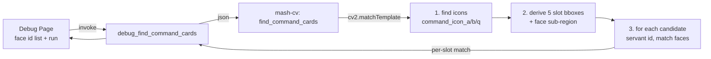

## Architecture



## Layout assumptions (calibrated empirically, lives in `cv.py` constants)

- Icons sit near the bottom of each card. From the icon bbox we derive:
  - `face_region`: same x range as icon, shifted up by ~(card_height − icon_height); width slightly cropped to the face circle.
  - `card_region`: full card bbox (just metadata, used by the debug overlay).
- All 5 cards across the bottom band → search region default `{x:0.0, y:0.55, w:1.0, h:0.45}`.

## Sidecar — [sidecar/mash_cv/mash_cv/cv.py](sidecar/mash_cv/mash_cv/cv.py)

Add `_find_command_cards(img, region, servant_ids, assets_dir)`:

1. For each suit in `("a","b","q")` match `command_icon_{suit}` inside `region` with `TM_CCOEFF_NORMED`, threshold ≥ 0.75.
2. Collect every peak ≥ threshold (use `np.where` + greedy x-NMS like `_read_turn`); cap at 5 across all suits, sorted by x.
3. For each accepted icon, compute `face_region` via fixed offsets (constants `FACE_DX, FACE_DY, FACE_W, FACE_H` relative to icon bbox).
4. If `servant_ids` is non-empty and `assets_dir` exists:
   - For each id, lazily load `{assets_dir}/{id}/card_servant_*.png` (cache in a module-level dict keyed by path). Convert to grayscale on first read.
   - For every face PNG, run `matchTemplate` inside the slot's `face_region`; track best `(servant_id, ascension, score)` ≥ 0.6.
5. Return:
   ```json
   {"cards":[{"slot":0,"suit":"a","x":0.097,"y":0.678,
              "iconRegion":{...},"faceRegion":{...},
              "iconScore":0.92,
              "servantId":284,"ascension":2,"faceScore":0.81}, ...]}
   ```

Register in the REPL dispatch (next to `find_element`):

```python
elif action == "find_command_cards":
    img, err = _load_frame(cmd)
    if img is None:
        _reply(req_id, {"cards": [], "error": err})
    else:
        _reply(req_id, _find_command_cards(
            img,
            cmd.get("region", {"x":0.0,"y":0.55,"w":1.0,"h":0.45}),
            cmd.get("servantIds", []),
            cmd.get("assetsDir"),
        ))
```

Add a pytest in `sidecar/mash_cv/tests/` driving the sidecar against the existing battle screenshot (`battle_*.png` in test_data) with a hand-picked servant id list.

## Rust — [src-tauri/src/screen.rs](src-tauri/src/screen.rs)

- Add `CommandCardMatch` serde struct (camelCase, `Option<u32>` for servantId/ascension since identification is best-effort).
- Add `SidecarClient::find_command_cards(image_path, region, servant_ids, assets_dir) -> Result<Vec<CommandCardMatch>, String>`.

## Rust — [src-tauri/src/lib.rs](src-tauri/src/lib.rs)

- Add `resolve_assets_dir(app)` next to `resolve_templates_dir`. In dev (`tauri::Builder` already runs from project root), return `<resource_dir>/../assets` then fall back to `CARGO_MANIFEST_DIR/assets` when that doesn't exist. Logs the resolved path.
- (Production bundling is intentionally deferred; if neither path exists, return `None` and the sidecar treats it as "no candidate identification".)

## Rust — [src-tauri/src/debug.rs](src-tauri/src/debug.rs)

Add `debug_find_command_cards(servant_ids: Vec<u32>) -> Vec<CommandCardMatch>`:

- Reuses `debug_image_path(app)` and `ensure_debug_sidecar`.
- Calls `client.find_command_cards(Some(&image_path), default_region, servant_ids, assets_dir)`.
- Register in `invoke_handler!` and add a sibling `debug_list_servant_assets() -> Vec<u32>` that walks `assets/` and returns the ids that have at least one `card_servant_*.png` (so the debug UI doesn't have to know what's available).

## Frontend — [src/components/DebugPage.tsx](src/components/DebugPage.tsx)

New section "指令卡识别":

- Multi-select input for servant ids (default = ids returned by `debug_list_servant_assets`, capped to first ~10; user can paste a comma list).
- "识别指令卡" button → `invoke<CommandCardMatch[]>("debug_find_command_cards", { servantIds })`.
- Render results as overlay rectangles on the captured screenshot (reuse the existing `<canvas>`/overlay div the page already has for `ProbeResult`). Each card box shows `Cn  suit  servantId? (score)`.
- Append a row to the existing log strip on each invocation.

## Out of scope (future)

- Wiring `find_command_cards` into `runner.handle_attack` to honor `attackPriority`.
- Production bundling of `assets/` (we keep `.gitignore` as-is for now).