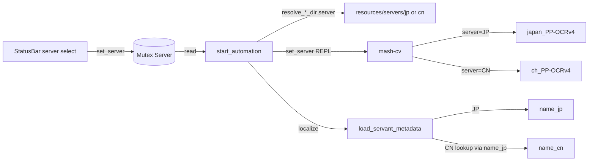

## Decisions baked in
- **Scope**: global app setting (like `useBluestack`), persisted in `app_data_dir()/server_settings.json`. Default `JP` so existing installs keep working.
- **NP names for OCR**: localized through the same JP→CN bridge as the servant name. `resources/servants.json` already carries `noble_phantasms[].name_jp` + `name_cn` per NP variant, so for `server=CN` we translate every JP NP name pulled from Atlas `servant.json` into its CN equivalent (dropping any NP whose JP name doesn't appear in the index — those are the "little bit problem" cases you'll clean up later). When the translated list ends up empty (all NPs unmapped, or an unknown servant), `_find_supports` falls back to a **name-only matching mode** so the run still proceeds at lower precision instead of failing outright.
- **CN templates**: scaffold the folder layout, copy the JP `cv.json` into it as a placeholder so the app still boots when CN is selected, but ship no PNGs yet — runtime will surface a clear "missing template" error rather than silently misdetecting.

## Architecture

## Layout changes

Move existing JP assets into a server-scoped directory and add a sibling for CN.

- `src-tauri/resources/servers/jp/cv.json` (moved from `resources/cv.json`)
- `src-tauri/resources/servers/jp/templates/` (moved from `resources/templates/`)
- `src-tauri/resources/servers/cn/cv.json` (placeholder copy of JP)
- `src-tauri/resources/servers/cn/templates/` (empty `.gitkeep` for now)
- Update `src-tauri/tauri.conf.json` `bundle.resources` to glob `resources/servers/**/*` instead of the old paths.
- `sidecar/mash_cv/mash_cv/models/`: add a CN entry. Either ship `ch_PP-OCRv4_rec_infer.onnx` + `ppocr_keys_v1.txt` now, or keep CN behind a "missing OCR model" warning until you drop the file in. Plan will scaffold the lookup either way.

## Backend changes

### New: `Server` enum + global state
In [src-tauri/src/lib.rs](src-tauri/src/lib.rs):
- `pub enum Server { Jp, Cn }` with `serde(rename_all = "UPPERCASE")` + `FromStr`/`Display`.
- Replace `Mutex<bool>` for bluestack with a struct or add a sibling `Mutex<Server>` managed by Tauri.
- Persist in `server_settings.json` next to `adb_settings.json`.
- New commands: `get_server() -> Server`, `set_server(value: Server)`.

### Server-aware resource resolvers
- Update `resolve_templates_dir(app, server)` and `resolve_cv_config_path(app, server)` in [src-tauri/src/lib.rs](src-tauri/src/lib.rs#L649-L658) to take a `Server` and return `resources/servers/{jp|cn}/...`.
- All call sites (`start_automation`, `debug::*`) pass the current global server.

### Localized servant metadata
- Extend `load_servant_metadata` in [src-tauri/src/lib.rs](src-tauri/src/lib.rs#L404-L461) to take a `server: Server` parameter.
- For `Server::Jp`: unchanged (use Atlas `name` and `noblePhantasms[].name`).
- For `Server::Cn`:
  - **Servant name**: read Atlas `name` (JP), find the matching row in `servants_data()` by `name_jp`, return its `name_cn`. Fall back to the JP name if unmapped so OCR still has *some* target.
  - **NP names**: build (lazily, OnceLock-cached) a flat `HashMap<String, String>` from `resources/servants.json` collecting every `noble_phantasms[*].(name_jp -> name_cn)` pair across both shapes the file uses (top-level list **and** dict-of-variants like `"初始": [...]`, `"奥特瑙斯": [...]`). For each Atlas JP NP name, look it up in the index. Drop unmapped entries (the "little bit problem" the user will fix later by tightening the source data); if every NP drops, return an empty list and let the sidecar handle name-only fallback.
  - Comparison is exact-string after `NFKC` + whitespace normalization (mirrors `_normalize_jp_text` in the sidecar) to absorb full-width vs. half-width drift between the two data sources without inventing fuzzy matching at lookup time.
- Update the cache key from `u32` to `(u32, Server)` so JP and CN names don't collide. Add an `np_index` OnceLock helper next to `servants_data()` so the index is built once per process.

### Sidecar set_server REPL command
In [sidecar/mash_cv/mash_cv/cv.py](sidecar/mash_cv/mash_cv/cv.py):
- Add a module-level `current_server: str = "JP"` and a new REPL command `{"cmd":"set_server","server":"CN"}` that updates it and resets `_ocr_engine = None` so the next OCR call rebuilds against the right model.
- Refactor `_get_ocr` to dispatch on `current_server` — JP keeps the existing `japan_PP-OCRv4_rec_infer.onnx`, CN tries `chinese_PP-OCRv4_rec_infer.onnx` (or the standard PaddleOCR Chinese model name) + matching dict file. If the CN model is missing, log clearly and fall back to `RapidOCR()` with a loud warning.
- `SidecarClient::spawn` in [src-tauri/src/screen.rs](src-tauri/src/screen.rs#L243-L341) gains a `server: Server` parameter and sends `set_server` right after `load_templates` / `load_config`.

### Name-only support matching (safety net)
In `_find_supports` in [sidecar/mash_cv/mash_cv/cv.py](sidecar/mash_cv/mash_cv/cv.py#L1085-L1253):
- When `expected_np_names` is empty (e.g. an unmapped CN servant whose NPs all dropped during JP→CN translation), skip the proximity-pairing loop and treat each above-threshold name candidate as its own row. Synthesize `rowRegion` from the name region only (expanded horizontally to the list region). `npText`/`npScore`/`npRegion` become empty strings / 0.0 / the name region.
- Diagnostics still populate `nameCandidates`; `npCandidates` stays `[]`.
- Pin the new behavior with a pytest in `sidecar/mash_cv/tests/`.
- This path is a **fallback**, not the primary CN flow — the expected steady state is that JP→CN NP translation fills `expected_np_names` and the existing pairing logic runs unchanged.

### Wiring
- In `start_automation` ([src-tauri/src/lib.rs](src-tauri/src/lib.rs#L550-L625)):
  - Read global `server`.
  - Pass it to `resolve_templates_dir` / `resolve_cv_config_path`.
  - Pass it to `SidecarClient::spawn` so `set_server` runs at boot.
- In runner's `handle_support_select` ([src-tauri/src/runner.rs](src-tauri/src/runner.rs#L949-L1003)): take server through `Runner::new` so `load_servant_metadata` is called with the right server. `meta.np_names` empty → already harmless because the sidecar will go name-only.
- Debug commands in `src-tauri/src/debug.rs` similarly pick up the current server when spawning the debug sidecar.

## Frontend changes

- `src/types/server.ts`: `export type Server = "JP" | "CN";`
- Extend [src/components/StatusBar.tsx](src/components/StatusBar.tsx) with a small `Select` next to the BlueStacks toggle: "服务器: JP / CN", calling `invoke<Server>("get_server")` on mount and `invoke("set_server", { value })` on change. Disable while `RunnerState::Running` (don't switch servers mid-run).
- No `Project` schema changes (server is global).

## Tests

- Rust unit tests in `lib.rs`:
  - `Server` round-trips through serde + FromStr/Display.
  - `load_servant_metadata` with `Server::Jp` returns Atlas JP name + JP NP names; with `Server::Cn` returns the `name_cn` from `servants.json` for a known id and CN NP names from the `noble_phantasms` index, falls back to JP name when unmapped, drops unmapped NPs.
  - NP index builder: handles both the dict-of-variants shape (e.g. servant id 1) and the flat-list shape; deduplicates entries with identical `name_jp`.
  - `resolve_templates_dir(app, Cn)` returns the CN path.
- Python pytest in `sidecar/mash_cv/tests/test_cv.py`:
  - `_find_supports` with empty `expected_np_names` returns one row per matched name candidate (name-only mode).
  - REPL subprocess: `set_server CN` then `find_supports` works.
- Frontend Vitest:
  - StatusBar renders the server select, calls `set_server` on change, hydrates from `get_server`.

## Out of scope (your "fix later")

- Cleaning up `resources/servants.json` so every Atlas JP NP name lines up exactly with a Mooncell `noble_phantasms[].name_jp` entry. The plan tolerates the current mismatches by silently dropping unmapped NPs and falling back to name-only support matching when none survive — once you tighten the source data, precision returns automatically with zero code changes.
- Capturing CN PNG templates and filling `resources/servers/cn/`.
- Coordinate retuning if CN turns out to differ — assumed identical until proven otherwise.
