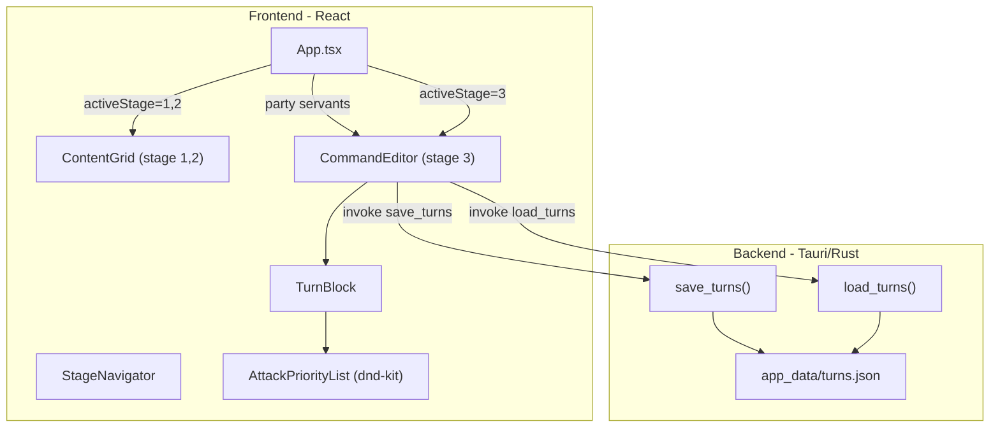

# Stage 3 Command Editor with Backend Persistence

## Key Design Decisions

- **Servant dropdown**: references the first 3 servants from Stage 1 party. If not yet selected, show placeholders "Servant 1", "Servant 2", "Servant 3".
- **Target dropdown**: always teammates (the same 3 servants), not enemies.
- **Skill dropdown**: each servant has 3 skills: "Skill 1", "Skill 2", "Skill 3".
- **Equipment**: always 3 mystic code skill options. Placeholder: "Skill 1", "Skill 2", "Skill 3". Real data provided later.
- **Attack block**: always present at the bottom of each turn (not added via button). Only 2 buttons in the Turn header: Servant and Equipment.
- **Attack is a priority list**: drag-reorderable, min 3 entries, user can add/delete rows. 12 card options total per servant set (3 servants x 3 command cards + 3 noble phantasms).

## Data Model

```typescript
// src/types/command.ts
export interface ServantAction {
  type: 'servant';
  id: string;
  servant: string | null;    // servant identifier (from party)
  skill: string | null;      // "skill_1" | "skill_2" | "skill_3"
  target: string | null;     // another servant identifier (teammate)
}

export interface EquipmentAction {
  type: 'equipment';
  id: string;
  skill: string | null;      // "skill_1" | "skill_2" | "skill_3"
}

export interface AttackCard {
  id: string;
  card: string | null;       // e.g. "servant_1_buster", "servant_2_np", etc.
}

export interface Turn {
  id: string;
  servantActions: ServantAction[];
  equipmentActions: EquipmentAction[];
  attackPriority: AttackCard[];   // ordered list, min 3
}
```

The `Turn` struct separates action types explicitly: `servantActions` and `equipmentActions` are added via buttons, while `attackPriority` is always present.

Rust equivalent in [src-tauri/src/lib.rs](src-tauri/src/lib.rs) mirrors these structs with serde.

## Architecture



## Frontend Changes

### 1. Conditional rendering in [App.tsx](src/App.tsx)

- Stage 1 or 2: render `ContentGrid` (existing)
- Stage 3: render `CommandEditor`, passing the `servants` array (first 3 = party servants)
- The party servants are already stored in `ContentGrid`'s `slots` state. To share them with `CommandEditor`, lift the slots state up to `App` or pass the `servants` array and let `CommandEditor` derive party info.

### 2. New component: `src/components/CommandEditor.tsx`

Manages `Turn[]` state. On mount, calls `invoke("load_turns")`. On changes, auto-saves via `invoke("save_turns", { turns })`.

- Renders list of `TurnBlock` components
- "Add New Turn" button at the bottom (full-width green button)
- When adding a new turn, it initializes with an empty `attackPriority` of 3 default rows

### 3. New component: `src/components/TurnBlock.tsx`

A single Turn card with 3 sections:

**Header**: "Turn N" label + 2 buttons (Servant, Equipment) + delete turn button

**Skill/Equipment rows** (middle section):
- **Servant row** (light blue bg): `[Servant select] Use [Skill select] to [Target select]` + delete row button
  - Servant select: shows party servants by name, or "Servant 1/2/3" if unselected
  - Skill select: "Skill 1", "Skill 2", "Skill 3"
  - Target select: same servant list (teammates)
- **Equipment row** (light purple bg): `Master use [Skill select]` + delete row button
  - Skill select: "Skill 1", "Skill 2", "Skill 3" (placeholder for mystic code skills)

**Attack priority list** (always at bottom, light pink bg):
- Drag-reorderable list using `@dnd-kit` (already a dependency)
- Each row is a single `<select>` dropdown with 12 options:
  - "Servant 1 - Quick", "Servant 1 - Arts", "Servant 1 - Buster"
  - "Servant 2 - Quick", "Servant 2 - Arts", "Servant 2 - Buster"
  - "Servant 3 - Quick", "Servant 3 - Arts", "Servant 3 - Buster"
  - "Servant 1 - NP", "Servant 2 - NP", "Servant 3 - NP"
- Each row has a drag handle and a delete button (disabled if only 3 rows remain)
- "Add Priority" button to append a new row

### 4. CSS in [App.css](src/App.css)

- `.turn-block` - card with rounded corners, light gray background
- `.turn-header` - flex row with turn label and action buttons
- `.turn-action-btn-servant` / `.turn-action-btn-equipment` - colored buttons (green/purple)
- `.action-row-servant` / `.action-row-equipment` - tinted background rows
- `.attack-priority-section` - light pink section
- `.attack-priority-row` - single priority entry with drag handle
- `.add-turn-btn` - full-width green button
- `.add-priority-btn` - add button within attack section

## Backend Changes

### 5. Tauri commands in [src-tauri/src/lib.rs](src-tauri/src/lib.rs)

- **`save_turns(turns: Vec<Turn>, app: AppHandle)`** - write to `{app_data_dir}/turns.json`
- **`load_turns(app: AppHandle) -> Vec<Turn>`** - read from file, return `[]` if not found

Register both in `invoke_handler`.

### 6. New types file: `src/types/command.ts`

TypeScript definitions as shown in Data Model above.

## Placeholder Data Summary

- Servants: "Servant 1", "Servant 2", "Servant 3" (or real names from Stage 1 party if selected)
- Skills: "Skill 1", "Skill 2", "Skill 3"
- Equipment skills: "Skill 1", "Skill 2", "Skill 3" (real data later)
- Attack cards (12 options): 3 servants x (Quick, Arts, Buster) + 3 NPs
