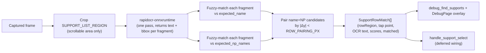

## Goal

Identify, on the support-select screen, which of the visible rows is the user-pinned servant by combining the **servant name** (e.g. `アルトリア・キャスター`) and a **noble-phantasm name** (e.g. `きみをいだく希望の星`) — both read via OCR. A row matches iff both texts are detected near each other vertically (within one row height).

The list is **scrollable**, so we cannot rely on fixed row y-coordinates. Instead we OCR the whole list region once per call, fuzzy-match every detected text fragment against the expected name and NP names, then pair the matches by vertical proximity to reconstruct rows on the fly.

The runner is *not* rewired in this plan beyond a stub call site — the deliverable is a working detector + debug surface. Craft-essence matching and class-filter automation are out of scope.



## 1. Sidecar: OCR engine

In [`sidecar/mash_cv/pyproject.toml`](sidecar/mash_cv/pyproject.toml) add `rapidocr-onnxruntime` to `[tool.poetry.dependencies]`. ONNX-only, bundles under PyInstaller without extra system binaries, supports Japanese out of the box.

Update [`sidecar/mash_cv/build_sidecar.sh`](sidecar/mash_cv/build_sidecar.sh) PyInstaller invocation with `--collect-data rapidocr_onnxruntime` so the bundled model files land in `_internal/`.

## 2. Sidecar: support detector

In [`sidecar/mash_cv/mash_cv/cv.py`](sidecar/mash_cv/mash_cv/cv.py):

- Add lazy singleton `_get_ocr() -> RapidOCR` (instantiated on first `find_supports` call so cold-start cost stays off `ping`).
- Add layout constants calibrated against `tests/test_data/screenshots/support_select.png` (2560×1440). The list area excludes the top tab bar and the right-side scrollbar:

```python
# Scrollable list area. Row count and y-positions are unknown at runtime
# (the user can scroll), so we OCR the whole region in one pass.
SUPPORT_LIST_REGION = {"x": 0.05, "y": 0.13, "w": 0.85, "h": 0.85}

# Two text fragments belong to the same support row iff their y-centers
# are within this fraction of the image height. One row in the reference
# screenshot spans ~0.20 of the image height; pairing tolerance is set
# to ~0.10 so we never cross row boundaries even at partial scroll.
SUPPORT_ROW_PAIR_DY = 0.10

SUPPORT_NAME_THRESHOLD = 0.75
SUPPORT_NP_THRESHOLD   = 0.75
```

Exact numbers re-tuned during implementation using `region_tool.py` against `support_select.png`.

- Add `_find_supports(img, list_region, expected_name, expected_np_names, name_threshold, np_threshold, pair_dy) -> dict`:

  1. Crop the image to `list_region` and run RapidOCR once on the crop. RapidOCR returns `[(box, text, conf), ...]` where `box` is a 4-point polygon in crop-local pixels. Convert each box to a normalized `{x,y,w,h}` in full-image coordinates.
  2. For each fragment, compute fuzzy similarity (`difflib.SequenceMatcher.ratio()` after stripping spaces / katakana voicing variants) against `expected_name` and against each entry in `expected_np_names`. Keep two candidate lists:
     - `name_candidates: [(box, text, score)]` where `score >= name_threshold`.
     - `np_candidates:   [(box, text, score, matched_np_name)]` where `score >= np_threshold`.
  3. Pair candidates: for each name candidate, find the np candidate whose y-center is closest and within `pair_dy`. A successful pair = one matched row. Greedy-consume so each fragment is only used once.
  4. Synthesize the row bbox from the pair (union of the two boxes, expanded horizontally to span the row). The tap point is the row's center.
  5. Always return diagnostic info — including unmatched name candidates and unmatched np candidates — so the debug UI can show why a row missed.

  Response shape:

```python
{
  "supports": [  # one record per matched row
    {
      "rowRegion": {x,y,w,h},        # synthesized row bbox (normalized)
      "tap": {"x": cx, "y": cy},     # row center (normalized)
      "nameText": str, "nameScore": float, "nameRegion": {x,y,w,h},
      "npText": str, "npScore": float, "npRegion": {x,y,w,h},
      "npMatchedName": str,          # which entry of expected_np_names matched
    }, ...
  ],
  "diagnostics": {
    "listRegion": {x,y,w,h},
    "nameCandidates": [{"text": str, "score": float, "region": {x,y,w,h}}],
    "npCandidates":   [{"text": str, "score": float, "matchedName": str, "region": {x,y,w,h}}],
    "fragmentCount": int,
  },
}
```

- Wire a new REPL command in `main()`:

```python
elif action == "find_supports":
    img, err = _load_frame(cmd)
    ...
    _reply(req_id, _find_supports(
        img,
        cmd.get("listRegion") or SUPPORT_LIST_REGION,
        cmd["expectedName"],
        list(cmd.get("expectedNpNames", [])),
        float(cmd.get("nameThreshold", SUPPORT_NAME_THRESHOLD)),
        float(cmd.get("npThreshold", SUPPORT_NP_THRESHOLD)),
        float(cmd.get("pairDy", SUPPORT_ROW_PAIR_DY)),
    ))
```

## 3. Sidecar tests

In [`sidecar/mash_cv/tests/test_cv.py`](sidecar/mash_cv/tests/test_cv.py) add `TestFindSupports`:

- Fixture: existing `tests/test_data/screenshots/support_select.png` (2560×1440 capture).
- Asserts (driven by what's actually visible in that screenshot — two Altria Caster rows, one Marlin row):
  - `supports` contains exactly two matches when `expected_name="アルトリア・キャスター"` and `expected_np_names=["きみをいだく希望の星"]`.
  - The two matches' `rowRegion.y` differ by roughly one row height (proves proximity pairing, not duplicate detection).
  - When `expected_name="マーリン"` is used instead, exactly one match is returned and its row sits between the two Altria rows.
  - When `expected_name="アルトリア・キャスター"` is paired with `expected_np_names=["永久に閉ざされた理想郷"]` (Marlin's NP), zero matches are returned (proves both name and NP must agree on the same row).
- `@pytest.mark.skipif` if `rapidocr_onnxruntime` import fails so existing unit-test runs without the dep don't break.

## 4. Rust bridge

[`src-tauri/src/screen.rs`](src-tauri/src/screen.rs):

- New structs mirroring sidecar response:

```rust
#[derive(Debug, Clone, serde::Serialize, serde::Deserialize)]
#[serde(rename_all = "camelCase")]
pub struct SupportRowMatch {
    pub row_region: NormRect,
    pub tap: Point,
    pub name_text: String,
    pub name_score: f64,
    pub name_region: NormRect,
    pub np_text: String,
    pub np_score: f64,
    pub np_region: NormRect,
    pub np_matched_name: String,
}

#[derive(Debug, Clone, serde::Serialize, serde::Deserialize)]
#[serde(rename_all = "camelCase")]
pub struct SupportCandidate {
    pub text: String,
    pub score: f64,
    pub region: NormRect,
    #[serde(default, skip_serializing_if = "Option::is_none")]
    pub matched_name: Option<String>,
}

#[derive(Debug, Clone, serde::Serialize, serde::Deserialize)]
#[serde(rename_all = "camelCase")]
pub struct SupportDiagnostics {
    pub list_region: NormRect,
    pub name_candidates: Vec<SupportCandidate>,
    pub np_candidates: Vec<SupportCandidate>,
    pub fragment_count: u32,
}

#[derive(Debug, Clone, serde::Serialize, serde::Deserialize)]
#[serde(rename_all = "camelCase")]
pub struct FindSupportsResult {
    pub supports: Vec<SupportRowMatch>,
    pub diagnostics: SupportDiagnostics,
}
```

- `SidecarClient::find_supports(image_path, expected_name, expected_np_names) -> Result<FindSupportsResult, String>`. Default thresholds + list region defaulted by the sidecar.

[`src-tauri/src/lib.rs`](src-tauri/src/lib.rs):

- Add `load_servant_metadata(app, id) -> Result<{name: String, np_names: Vec<String>}, String>` reading `assets/servants/{id}/servant.json` (using `resolve_servant_assets_dir`). Cache in a `OnceLock<Mutex<HashMap<u32, ...>>>` so repeat lookups are free.
- Expose Tauri command `get_servant_metadata(id)` for the debug UI to populate the picker.

## 5. Debug command + UI

[`src-tauri/src/debug.rs`](src-tauri/src/debug.rs):

```rust
#[tauri::command]
pub fn debug_find_supports(
    app: tauri::AppHandle,
    debug_state: tauri::State<'_, DebugSidecar>,
    handle_state: tauri::State<'_, Mutex<RunnerHandle>>,
    servant_id: u32,
) -> Result<FindSupportsResult, String>
```

Loads metadata via the helper above, then calls `client.find_supports(...)` against the most recent `debug/last.jpg`. Same `require_automation_idle` + `ensure_debug_sidecar` plumbing the other debug commands use.

Register in `lib.rs` `invoke_handler![...]`.

[`src/components/DebugPage.tsx`](src/components/DebugPage.tsx) — add a panel below the existing "指令卡 / 宝具" section:

- DTOs: `SupportRowMatchDto`, `SupportCandidateDto`, `SupportDiagnosticsDto`, `FindSupportsResultDto`.
- Picker (re-uses `availableServantIds` from `debug_list_servant_assets`) → "识别助战" button → call `debug_find_supports`.
- Overlays on top of the screenshot using the existing overlay pattern (`commandCards` renderer at ~line 380 onward is the model):
  - Solid-bordered rectangles for each `supports[].rowRegion` (matched rows), with the OCR'd name + NP text inline.
  - Dashed/translucent rectangles for `diagnostics.nameCandidates` and `diagnostics.npCandidates` (so misses are visible).
  - Crosshair at each `supports[].tap` point.
- Log entries showing fragment count, # name candidates, # NP candidates, and final matched-row count for each call.

## 6. Runner stub (minimal change)

[`src-tauri/src/runner.rs`](src-tauri/src/runner.rs) `handle_support_select` (lines 656–714): leave the existing scroll/refresh behavior alone. Add a comment + TODO that this should be replaced with a `find_supports` call once the detector is validated through the debug UI; do not change runtime behavior in this PR.

(Full runner rewiring — pulling pinned servant id from `RunConfig`, loading metadata, tap on first matched row — will be a follow-up plan once the user confirms detector accuracy.)

## Out of scope

- Craft-essence template matching inside the matched row.
- Class filter automation (existing TODO).
- Scrolling strategy changes.
- Production bundling of `assets/servants/` (still resolved via the dev-time path in `resolve_servant_assets_dir`).
