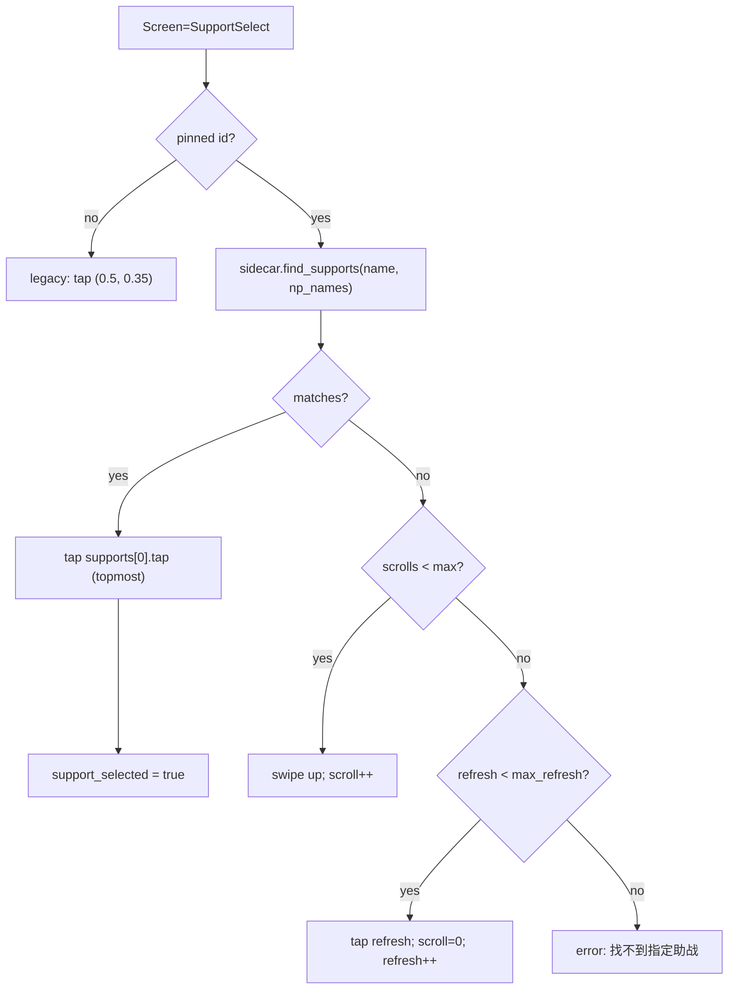

## Goal

Replace the legacy template-based `handle_support_select` with the new OCR detector. The runner must:

1. Read the pinned support servant id off the active project.
2. On each `SupportSelect` poll: OCR via `find_supports`, tap the topmost matched row, or scroll/refresh.
3. Hard-cap the scroll/refresh loop so an unavailable servant stops cleanly instead of looping forever.



Out of scope (kept as TODOs): class-filter automation, craft-essence template matching, persisting the rest of the team-builder slots.

## 1. Persist `supportServantId` on `Project`

In [src-tauri/src/lib.rs](src-tauri/src/lib.rs):

- Extend the `Project` struct (line 64) with `pub support_servant_id: Option<u32>`, `#[serde(default)]` so existing `projects.json` rows still deserialize.
- Add a Tauri command:

```rust
#[tauri::command]
fn update_project(app: tauri::AppHandle, project: Project) -> Result<Project, String>
```

It reads `projects.json`, finds the matching id, replaces the entry, writes it back. Register in `invoke_handler!` next to `create_project` / `delete_project`.

In [src/types/project.ts](src/types/project.ts):

```ts
export interface Project {
  id: string;
  name: string;
  supportServantId?: number | null;
}
```

## 2. Hook the team-builder support slot to the active project

In [src/components/ContentGrid.tsx](src/components/ContentGrid.tsx):

- Drop the early `if (slot.type === "support") return;` in `handleSlotClick` (line 172) so the support tile opens `ServantSelectDialog` like the other slots.
- The support slot's filled visual reuses the regular filled slot card, but with a small "助战" badge so it's still identifiable.

In [src/App.tsx](src/App.tsx):

- Resolve the active project from `activeProjectId` via the cached `list_projects` result (cache it in App state so the support slot has something to read/write).
- Override the support slot's `servant` from `activeProject.supportServantId` (look up via the `servants` array). Stop relying on `slots[]` for the support entry — keep the slot visual but treat the support pin as project-owned state.
- When the user picks a servant for the support slot, call `invoke("update_project", { project: { ...activeProject, supportServantId: chosenId } })` and refresh local project cache.

## 3. Plumb the pin through `RunConfig`

In [src-tauri/src/runner.rs](src-tauri/src/runner.rs):

- Add `pub support_servant_id: Option<u32>` to `RunConfig` (line 27); `#[serde(default)]`.

In [src/components/BattlePage.tsx](src/components/BattlePage.tsx) `handleStart` (line 67):

- Look up the selected project from local `projects` state and pass `supportServantId: project?.supportServantId ?? null` in the `start_automation` payload. Drop the legacy `supportServantName: null` once the runner stops reading it (Step 4 keeps it as a fallback for one release).

## 4. Rewrite `handle_support_select`

In [src-tauri/src/runner.rs](src-tauri/src/runner.rs) (lines 656-724) replace the body with an OCR-driven flow. Key shape:

```rust
fn handle_support_select(&mut self) {
    let Some(servant_id) = self.config.support_servant_id else {
        // No pin → legacy fallback (tap top row).
        self.legacy_pick_first_support();
        return;
    };

    // Cache metadata once per run so we don't hit disk every poll.
    let meta = match self.support_meta.get_or_try_init(...) { ... };

    let result = match self.sidecar.find_supports(None, &meta.name, &meta.np_names) {
        Ok(r) => r,
        Err(e) => return self.fail_action("SupportSelect", "OCR 助战识别", e),
    };

    if let Some(row) = result.supports.first() {
        // supports is already sorted top-down by the sidecar; first = topmost.
        self.emit("SupportSelect", &format!(
            "找到助战 {} (name {:.2}, np {:.2})",
            meta.name, row.name_score, row.np_score,
        ));
        if !self.tap_at("SupportSelect", row.tap) { return; }
        self.support_selected = true;
        self.support_scroll_count = 0;
        self.support_refresh_count = 0;
        thread::sleep(ACTION_DELAY);
        return;
    }

    // No hit → scroll, then (after max_support_scrolls) refresh, then (after
    // SUPPORT_MAX_REFRESHES) fail loudly so the user isn't stuck forever.
    if self.support_scroll_count < self.config.max_support_scrolls {
        self.swipe_at("SupportSelect", Point::new(0.50, 0.70), Point::new(0.50, 0.30), 300);
        self.support_scroll_count += 1;
        thread::sleep(SUPPORT_SCROLL_SETTLE); // ~1s, lets momentum stop
    } else if self.support_refresh_count < SUPPORT_MAX_REFRESHES {
        self.tap_at("SupportSelect", Point::new(0.92, 0.08));
        self.support_scroll_count = 0;
        self.support_refresh_count += 1;
        thread::sleep(SUPPORT_REFRESH_SETTLE); // ~3s
    } else {
        self.fail_action("SupportSelect", "查找助战",
            format!("刷新 {} 次仍未找到 {}", SUPPORT_MAX_REFRESHES, meta.name));
    }
}
```

New constants near other support tunables:

- `SUPPORT_MAX_REFRESHES: u32 = 3` — abort instead of looping forever.
- `SUPPORT_SCROLL_SETTLE: Duration = Duration::from_millis(900)` — wait for momentum scroll.
- `SUPPORT_REFRESH_SETTLE: Duration = Duration::from_secs(3)` — friend list refetch animation.

New runner state (next to `support_scroll_count`, line 379):

- `support_refresh_count: u32`
- `support_meta: OnceCell<ServantMetadata>` — cache the (name, np_names) tuple after first load to avoid disk reads every 500ms poll.

Keep `support_servant_name` field but mark it `#[deprecated]`; the only path that still consults it is the no-pin fallback `legacy_pick_first_support()`.

## 5. Sanity test

- Re-run the existing `TestFindSupports` cases; the detector itself is unchanged.
- Manual: pin Altria Caster (#284) on a project, hit "开始" against the support-select screen captured under [sidecar/mash_cv/tests/test_data/screenshots/support_select.png](sidecar/mash_cv/tests/test_data/screenshots/support_select.png) — runner should tap the topmost match within one OCR cycle. Manually verify the scroll path by pinning a servant that isn't in the visible page.