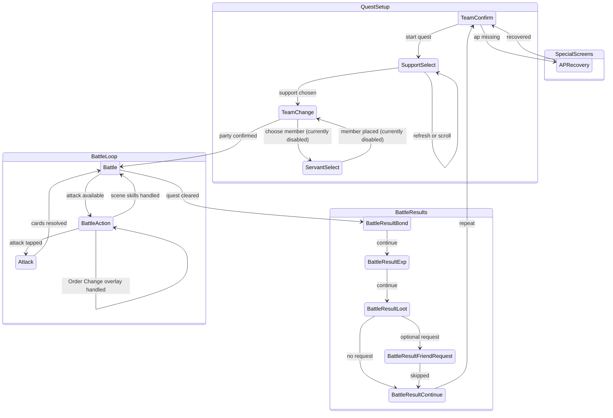

# Battle Automation Screen Relationships

This diagram tracks the battle screen relationship model implemented by
`src-tauri/src/runner.rs`. Screen identity comes from `SidecarClient::detect`,
which is backed by `src-tauri/resources/servers/<server>/cv.json`.

Party servant auto-placement is intentionally disabled for now. The runner
still accepts `servantSelections` in `RunConfig`, but `TeamConfirm` ignores
them until that feature is adapted; it proceeds directly to starting the
quest once the support and existing team state are ready.

## Template Probes

Battle-specific template probes live in `cv.json` under
their real screens:

- `Battle.variants.main.elements.attack_button`: determines when the battle
  screen is actionable status.
- `SupportSelect.variants.main.elements.support_scroll_end`: detects the bottom
  of the support list.
- "冠位从者" ribbon probe (CN-only, surfaced as
  `FindSupportsResult.diagnostics.isGrandSectionVisible` plus the per-row
  `diagnostics.grandRibbonAnchorScores` aligned 1-1 with
  `confirmButtonAnchors`). Grand servants are ordered before ordinary
  servants, so the runner needs to know when the Grand section has
  scrolled off-screen. The sidecar template-matches the gold-on-blue
  ribbon (`text_grand_servant_support_bottom_line` PNG) inside a tight
  ROI at a fixed offset to the left of every detected
  `confirm_button_anchors` entry. Each anchor records its own
  TM_CCOEFF_NORMED score; the aggregate flag is `any(score ≥ threshold)`.
  After the first visible ribbon has been seen in the current refreshed
  list, two consecutive misses mean the runner treats the Grand section
  as exhausted and refreshes instead of scrolling through ordinary
  supports. Per-anchor scores are required by the debug overlay — a
  partly-Grand list ("row 1 is Grand, row 2 is ordinary") would
  otherwise paint both rows green from the single aggregate bool and
  hide the false positive. The earlier implementation scanned the
  entire avatar column for the ribbon, which kept false-matching other
  gold-on-blue chrome (登录顺序 button, score banners) and either kept
  the runner scrolling past an exhausted section or stopped scrolling
  too early.
- `SupportSelect.variants.refreshConfirm.detect` / `.elements.dialog_refresh_support`:
  detects the JP refresh-confirm modal that appears after tapping the support
  refresh button; the runner confirms it, then waits for the modal to vanish
  before resuming OCR/scroll.
- Support-list scroll distance is adaptive. The sidecar surfaces every visible
  `button_support_form_confirm` anchor in `FindSupportsResult.diagnostics.confirmButtonAnchors`;
  the runner sets the swipe delta from the last detected anchor to the
  first-row target y: `last_anchor.y - SUPPORT_SCROLL_TARGET_TOP_ANCHOR_Y`,
  clamped to `[SUPPORT_SCROLL_MIN_DELTA, SUPPORT_SCROLL_MAX_DELTA]`. It does
  not extrapolate hidden/partial rows from row pitch, because that can skip a
  servant that is already partly visible at the bottom. When no anchors are
  visible — usually a template/shape detector glitch — the runner falls back to
  `SUPPORT_SCROLL_FALLBACK_DELTA` so it still makes forward progress.
- Support-list scroll gestures go through the pluggable
  **`TouchBackend`** trait (`src-tauri/src/touch/`) rather than calling
  `adb shell input swipe` directly. A plain linear swipe lifts off at
  the average swipe velocity, which Android's `VelocityTracker`
  interprets as a *fling* once it crosses the per-device threshold
  (≈100–300 px/s on most modern devices) — so even when the runner's
  intended Δ was correct, the list kept scrolling after lift-off and
  overshot. `TouchBackend::swipe_with_settle` therefore holds contact
  at the destination long enough that the velocity tracker's sliding
  window sees ~0 px/s right before UP, so the system never enters
  fling mode.

  The only implementation today is **`adb-input`** (`touch/adb_input.rs`),
  which wraps `Adb::tap` / `Adb::swipe` / `Adb::swipe_with_settle`.
  `swipe_with_settle` drives the DOWN / MOVE / settle / UP shape via
  chained `input motionevent` commands in a single `adb shell`
  invocation. The MOVE event count is picked by
  `settle_swipe_move_steps(swipe_ms)` to target ~20 ms between events
  (≈50 Hz), clamped to `[4, 30]` so a short swipe still gets a few
  events and a long one doesn't pile on hundreds. On real devices
  each `input motionevent` runs in <10 ms (measured), so the full
  scroll cycle — active MOVE phase (~280 ms at the current 2.0
  norm/s velocity), settle hold (250 ms), post-swipe wait for the
  list to redraw (450 ms) — finishes in roughly 1 s. The trait
  indirection stays so a faster transport (minitouch, raw
  `sendevent`, native helper, …) can be added without changing
  runner call sites; earlier prototypes of both lived under `touch/`
  and were removed once `adb-input` proved fast and reliable enough.

  Each scroll emits a debug-level operation log entry tagged with the
  backend that actually fired
  (`滚动助战列表: 按钮 y=[…] (n=…) Δ=… swipe=…→… (Xms+Yms settle) [adb-input]`),
  so an operator can tell at a glance which gesture path produced the
  scroll they're triaging. Debug-level entries are hidden by default
  behind the status-bar "显示调试" toggle.

## Operation log levels

`AutomationEvent.level` (and the matching `EnhancementAutomationEvent.level`)
classifies each runner status emit as `info` or `debug`. The `Runner::emit`
helper defaults to `info` — the existing user-facing operation log entries
("找到助战 …", "刷新助战列表 …", "{action}失败: …"). `Runner::emit_debug`
sends technical diagnostics (CV anchor positions, swipe distances) that
the frontend filters out of the operation log panel by default. The
status-bar "显示调试" checkbox flips the filter so both levels render —
debug entries are styled dimmer and don't count toward the
"操作日志 (N)" trigger badge. Add new debug-level emits via `emit_debug`
when the message is only useful for triage; reserve `emit` for events
the operator should always see.
- `Battle.variants.main.elements.battle_scene_anchor`: exposes the
  `text_battle_label` region to debug; full
  `BATTLE m/n` reading still uses `read_battle_scene`.
- `BattleResultBond.detect`: detects the normal bond-points label
  (`text_battle_result_bond`). `BattleResultBondLevelUp.detect` uses a
  separate center-dialog region for the bond-level-up overlay label
  (`text_battle_result_bond_level_up`); Rust routes it to the same
  `BattleResultBond` handler.
- `BattleResultExpLevelUp.detect`: detects the CN equipment / skill level-up
  overlay (`text_battle_result_equip_level_up`) and routes to the same
  `BattleResultExp` handler. It has elevated priority because the overlay
  leaves the battle HUD visible and can otherwise be classified as `Battle`.

## Support OCR Names

Support selection loads the target servant metadata through
`load_servant_metadata` before calling sidecar `find_supports`. On the CN
server, Rust translates Atlas JP servant and Noble Phantasm names with
`src-tauri/src/resources/servants.json` so OCR matches the text rendered
by the CN client.

When a servant or NP entry has a non-empty `name_cn_server`, that value is
the OCR match target. `name_cn` remains the fallback. This handles CN
server renames where the in-game support row no longer matches the wiki
Chinese name. The mapper keeps `name_jp == name_cn` entries instead of
treating them as untranslated placeholders, because legitimate names can
be identical across JP/CN and can still be overridden by `name_cn_server`.

The sidecar pairs support rows by layout, not by text alone: the NP match
must be a distinct OCR fragment below the servant-name fragment in the
same row. This prevents servants whose displayed name and NP text are the
same from reusing the name line as a false NP match.

## Support Craft Essence Filter

When a support CE is configured, the runner first matches the row's CE
art against `assets/ces/{id}/card_ce.png`. If the slot's MLB requirement
is enabled (default), the same `verify_support_ce` call also requires
`icon_mlb_mark` in the CE's lower-right area.

Grand support mode replaces the single CE check with three positional CE
checks. Unconfigured Grand slots are skipped. Each configured slot can
require MLB independently. The second Grand slot can additionally require
one of the Grand bond icons: `icon_grand_bond_ce` for the original bond
CE, or `icon_grand_bond_ce_np` for the Grand-linked bond CE. Enabled CE
art and icon checks must all pass before the row can be selected.

On CN Grand support lists, the runner also watches the per-anchor
"冠位从者" ribbon probe surfaced as
`SupportDiagnostics.isGrandSectionVisible` (see the Template Probes
section). If no matching support row was selected, the runner first needs
to see at least one visible ribbon in the current refreshed list. Once
seen, two consecutive missing probes mean the remaining visible rows are
ordinary supports, so it refreshes
instead of continuing to the scroll-bar bottom. If the marker was never seen,
the runner keeps the older scroll-to-bottom behavior for that refreshed list.
Server bundles without this probe also keep the older scroll-to-bottom
behavior.

## Support Skill / NP Level Filter (CN)

When the active project sets any of `supportNoblePhantasmLevelMin`,
`supportSkillLevelMins`, or `supportAppendSkillLevelMins`, the runner
runs the OCR'd row through `support_row_matches_level_requirements_with_progress`
before tapping it. The function returns:

- `Pass` — name + NP + every required level meets its threshold.
- `Fail` — at least one level is below the configured minimum (with the
  panel that's currently visible). The runner moves on to the next row.
- `WaitingForPanel` — the visible panel matches its slice of the
  requirements, but the *other* panel (owned vs append) hasn't been
  observed for this candidate yet.

Owned and append skill icons share the same row strip; the game decides
which panel is shown via the skill-display toggle (a 3-state cycle:
fixed owned / fixed append / interval switching). The runner can't tell which mode the
user has the toggle locked into — and fixed modes never auto-flip — so
on `WaitingForPanel` it actively taps `SUPPORT_SKILL_PANEL_TOGGLE_BUTTON`
and re-OCRs after a short settle. `SupportLevelPanelProgress.panel_toggle_taps`
caps this at `SUPPORT_SKILL_PANEL_MAX_TOGGLE_TAPS` per candidate; once
the cap is hit, the runner falls through to the scroll/refresh branch
so a row that genuinely can't be verified doesn't trap the loop. The
counter resets implicitly whenever `support_level_candidate_key`
changes (i.e. when the runner moves to a different row).

## Notes

- `BattleSceneTick` is internal state, not a `Screen` enum variant. It maps the
  latest `BATTLE m/n` read through `tick_scene_state` and gates skill execution.
- `BattleAction` is a documentation-only status node for the actionable battle
  condition where `Battle.variants.main.elements.attack_button` is found.
- `BattleResultBond` covers ordinary bond-points settlement. The separate
  `BattleResultBondLevelUp` CV screen covers the bond-level-up overlay and
  routes to the same next-button tap target.
- `BattleResultExp` covers ordinary master / servant EXP settlement. The
  separate `BattleResultExpLevelUp` CV screen covers the equipment / skill
  level-up overlay and routes to the same next-button tap target.
- In-battle Order Change is stored on an equipment action as
  `orderChange.front` + `orderChange.back`. The runner taps the master skill,
  lets the semi-transparent Battle overlay settle, selects exactly one
  front-line slot (`servant_1..3`) and one back-line slot (`servant_4..6`),
  confirms, then waits for the attack button before continuing. This overlay
  is not the pre-battle `TeamChange` screen and is not detected through the
  `Screen::TeamChange` route.
- In normal mode, `battle_scenes.json` stores attack selection in
  `attackPriority`. The first three rows are the intended card chain order
  (first, second, third card); rows after that are fallback priorities. The
  runner walks the list in order and skips entries whose NP is not ready or
  whose matching command card did not appear, so a configured `Buster / NP /
  Buster` chain remains `Buster, NP, Buster` when two Buster cards are
  visible. Empty fixed chain rows inherit the previous non-NP fixed row, so
  `NP / All / empty` chooses NP plus two command cards when available; NP rows
  are never inherited because one NP slot can only be used once per turn. It
  does not regroup duplicate colors ahead of the NP. Fallback rows after the
  first three repeat while they can still match before the next fallback row is
  considered. Before command-card recognition, normal mode applies already
  executed current-scene preparation actions whose `change_order_servants.json`
  timing is `immediate` (for example Order Change) to the front-line servant id
  map. For previous scenes, it also applies configured NP attack rows that
  trigger `immediate` retreat/removal rules, then applies preparation-action
  rules whose timing is `endOfTurn` (for example skill-based end-of-turn
  retreat/death). Current-scene NP rows and `endOfTurn` skill exits are not
  applied until the scene is past, so the runner does not remove a servant
  before selecting that servant's NP or remaining same-turn cards.
  A normal-mode attack entry may also use `servant_{i}_all`, which matches the
  leftmost unused command card owned by that front-line servant regardless of
  B/A/Q color.
- Advanced-mode teams store battle scenes in `advanced_battle_scenes.json`.
  The current strategy UI uses a three-stage flow. First, the runner enters
  the attack-card screen and treats the scene as "waiting for startup": it
  checks the configured five command-card startup conditions, unless the scene
  enables Grand auto Order Change as its startup condition. In that Grand mode,
  the runner counts the current front line's recognized command cards, chooses
  the front servant with the highest count (leftmost on ties), uses Mystic Code
  `skill_3` to swap that servant with the back-line main Grand servant, then
  treats startup as satisfied. It still executes the current turn's next
  `controlActions` entry before `startupActions`, so the first post-swap turn
  consumes the same per-turn control slot as ordinary startup matching. Those
  actions are resolved by the originally selected servant identity: a configured
  back-line main Grand action is rewritten to its current front-line slot, while
  an action whose selected servant was moved to the back line is skipped. If ordinary
  command-card startup conditions do not match, it optionally taps the
  bottom-right attack-screen return button and executes one `controlActions` entry per
  turn in configured order, then re-enters the attack-card screen and attacks
  with the automatic priority strategy while passing an empty NP list so no
  Noble Phantasm is released. Once all control actions have been consumed,
  later non-matching turns keep using the same no-NP automatic attack. When
  the startup condition matches, the runner taps the bottom-right return button,
  executes `startupActions`, reapplies explicit Order Change effects to the
  active front-line id map, then re-enters the attack-card screen. From that
  point the scene is in automatic battle mode. In ordinary advanced scenes,
  ready NPs and command cards are scored together with the configured
  main-output servant, output type, and NP color (`npCard`, or the servant
  resource's `noblePhantasmCard` when set to automatic). In Grand battle mode,
  the project stores one or two `grandServants`; the first is the main output
  and the second is the deputy. The automatic picker prefers main-servant
  three-card chains first, then deputy chains, with exquisite B/A/Q chains
  ahead of same-color force/quick/skill chains and ordinary brave chains.
  Same-color chains that include the main output outrank same-color chains
  that include the deputy. Exquisite damage-priority chains place the target
  NP last; NP-priority chains place a red command card before a non-red target
  NP when available. Same-color chains with a target NP place the NP first
  because command-card position performance does not apply to NPs. If no chain
  is available, the picker can place deputy or auxiliary ready NPs before the
  target NP for overcharge, then keeps output servant command cards later so
  they receive the second/third-card performance bonus. Legacy advanced `rules`
  are still supported: when a scene has rule entries, the older rule evaluator
  runs instead of the three-stage strategy flow.
- `waiting_for_battle` extends Unknown tolerance during loading and long attack
  animations.
- `APRecovery` now anchors on `label_item` and scans the item-column template
  region in priority order instead of tapping fixed rows. Top page scans
  rainbow / gold / silver items; after one downward swipe the runner scans bronze items. A missing
  template match is treated as "insufficient quantity" because the dimmed overlay suppresses
  the template score.
- Updating `Screen`, battle result handling, AP recovery behavior, or
  battle screen variant probes requires updating this document.
