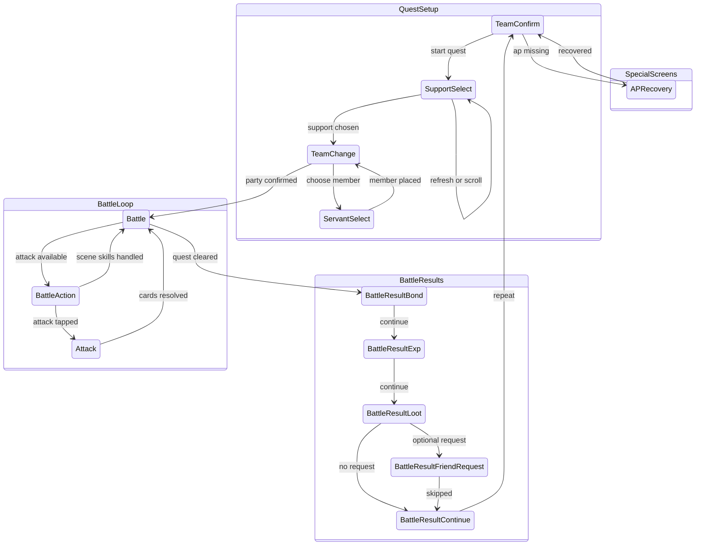

# Battle Automation Screen Relationships

This diagram tracks the battle screen relationship model implemented by
`src-tauri/src/runner.rs`. Screen identity comes from `SidecarClient::detect`,
which is backed by `src-tauri/resources/servers/<server>/cv.json`.

## Template Probes

Battle-specific template probes live in `cv.json` under
their real screens:

- `Battle.variants.main.elements.attack_button`: determines when the battle
  screen is actionable status.
- `SupportSelect.variants.main.elements.support_scroll_end`: detects the bottom
  of the support list.
- `Battle.variants.main.elements.battle_scene_anchor`: exposes the
  `text_battle_label` region to debug; full
  `BATTLE m/n` reading still uses `read_battle_scene`.

## Notes

- `BattleSceneTick` is internal state, not a `Screen` enum variant. It maps the
  latest `BATTLE m/n` read through `tick_scene_state` and gates skill execution.
- `BattleAction` is a documentation-only status node for the actionable battle
  condition where `Battle.variants.main.elements.attack_button` is found.
- `waiting_for_battle` extends Unknown tolerance during loading and long attack
  animations.
- Updating `Screen`, battle result handling, AP recovery behavior, or
  battle screen variant probes requires updating this document.
