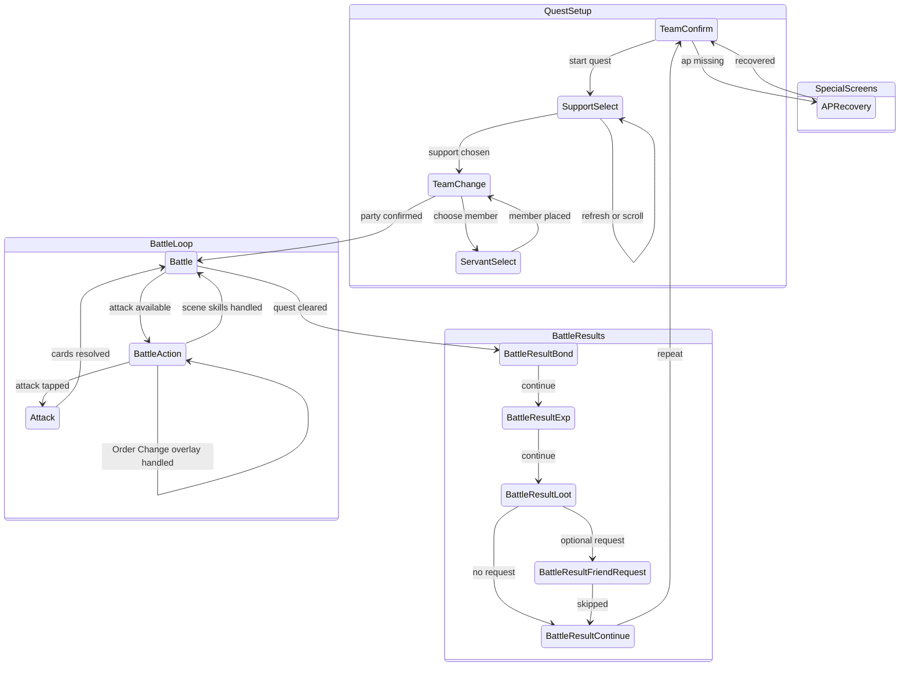

# Battle Automation Screen Relationships

This diagram tracks the battle screen relationship model implemented by
`src-tauri/src/runner.rs`. Screen identity comes from `SidecarClient::detect`,
which is backed by `src-tauri/resources/servers/<server>/cv.json`.

## Template Probes

Battle-specific template probes live in `cv.json` under
their real screens:

- `Battle.variants.main.elements.attack_button`: determines when the battle
  screen is actionable status.
- `SupportSelect.variants.main.elements.support_scroll_end`: detects the bottom
  of the support list.
- `SupportSelect.variants.refreshConfirm.detect` / `.elements.dialog_refresh_support`:
  detects the JP refresh-confirm modal that appears after tapping the support
  refresh button; the runner confirms it, then waits for the modal to vanish
  before resuming OCR/scroll.
- `Battle.variants.main.elements.battle_scene_anchor`: exposes the
  `text_battle_label` region to debug; full
  `BATTLE m/n` reading still uses `read_battle_scene`.

## Notes

- `BattleSceneTick` is internal state, not a `Screen` enum variant. It maps the
  latest `BATTLE m/n` read through `tick_scene_state` and gates skill execution.
- `BattleAction` is a documentation-only status node for the actionable battle
  condition where `Battle.variants.main.elements.attack_button` is found.
- In-battle Order Change is stored on an equipment action as
  `orderChange.front` + `orderChange.back`. The runner taps the master skill,
  lets the semi-transparent Battle overlay settle, selects exactly one
  front-line slot (`servant_1..3`) and one back-line slot (`servant_4..6`),
  confirms, then waits for the attack button before continuing. This overlay
  is not the pre-battle `TeamChange` screen and is not detected through the
  `Screen::TeamChange` route.
- `waiting_for_battle` extends Unknown tolerance during loading and long attack
  animations.
- `APRecovery` now anchors on `label_item` and scans the item-column template
  region in priority order instead of tapping fixed rows. Top page scans
  `彩/金/银`; after one downward swipe the runner scans `青铜/赤铜`. A missing
  template match is treated as "数量不足" because the dimmed overlay suppresses
  the template score.
- Updating `Screen`, battle result handling, AP recovery behavior, or
  battle screen variant probes requires updating this document.
