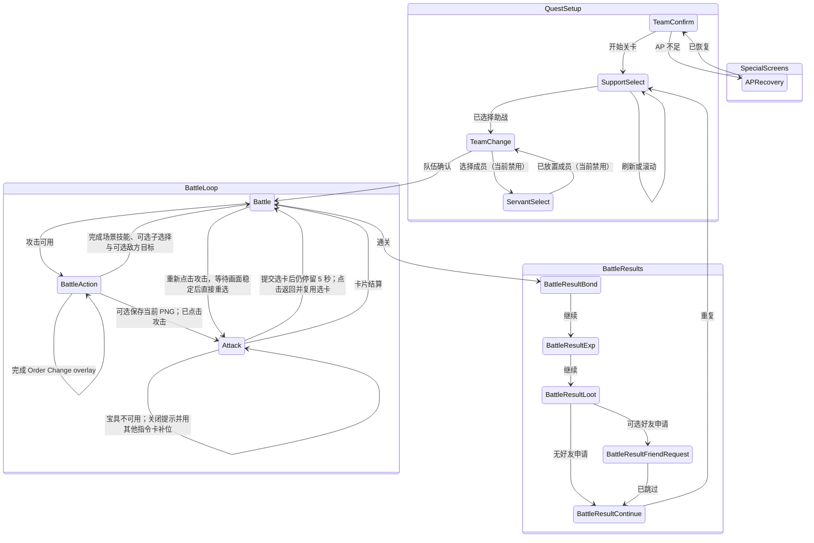
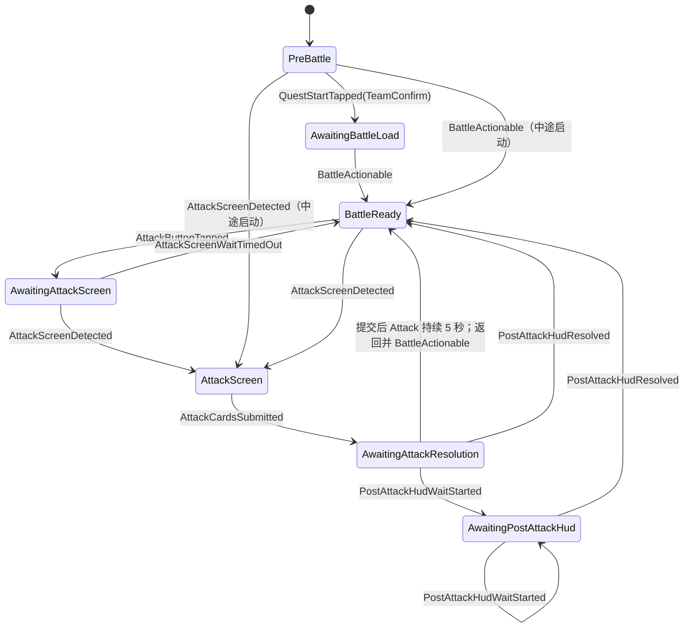
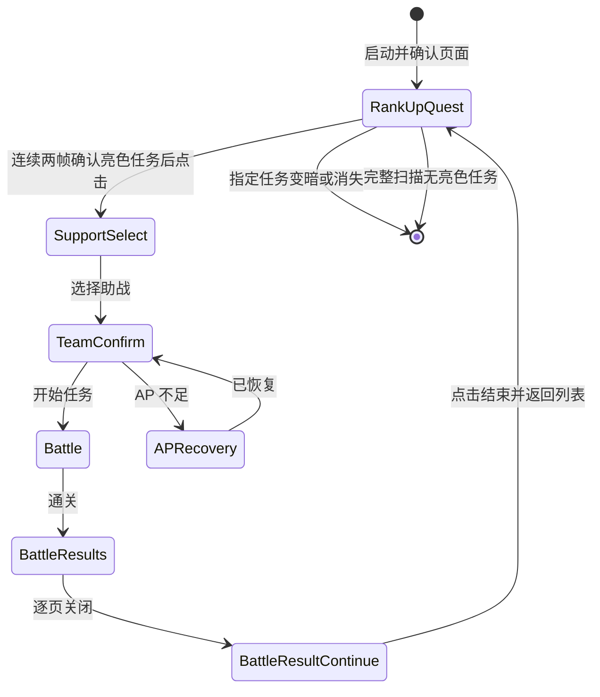

# 战斗自动化画面关系

本图描述 `src-tauri/src/runner/` 实现的战斗画面关系模型。画面身份来自 `SidecarClient::detect`，其配置来源为 `src-tauri/resources/servers/<server>/cv.json`。

从者自动放置目前刻意禁用。Runner 仍在 `RunConfig` 接受 `servantSelections`，但在功能完成适配前，`TeamConfirm` 会忽略它们；助战与现有队伍状态准备好后即直接开始关卡。

## 内部流程状态机

`Screen` 是 CV classifier 输出。战斗 runner 的权威流程状态是 `src-tauri/src/runner/state.rs` 的 `BattleFlowState`；screen observation 和已完成 action 以 `BattleFlowEvent` 进入。转换表集中在 `battle_flow_transition`，无效 event 不改变当前状态。

- `BattleFlowState` 管理加载、等待 Attack 画面、已提交卡片和攻击后 HUD 等短暂流程事实；此前这些事实由独立 boolean/timestamp 表示。
- `BattleState` 管理持久上下文：当前 Battle/turn index、上次 HUD 场景读取、已执行的 scene/turn key、指令卡识别 fallback 状态、攻击前宝具条识别缓存，以及 advanced-mode control/skill-turn index。
- 连续 `Unknown` 的停止阈值来自「游戏 → 基础设置」中的“识别超时”，所有流程共用同一个检测次数。每次主循环约 0.8 秒，范围为 50–1000 次，默认 100 次；关闭限制时内部阈值写为 9999 次。
- `awaiting_attack_resolution()` 在 `AwaitingAttackResolution` 或 `AwaitingPostAttackHud` 时为真，避免 classifier 仍显示 Attack 时重复提交卡片。
- `AwaitingAttackResolution` 保存实际提交时间。若 classifier 连续停留在 `Attack` 达 5 秒，runner 点击右下返回、等待 Battle 的攻击按钮与动作菜单、重新点击攻击；新的 Attack 画面连续稳定两次并额外等待 1 秒后，复用缓存的指令卡识别结果，但按当前识别模式重新读取宝具状态；原计划中已不可用的宝具会替换为未使用的指令卡。恢复重选是唯一强制确认路径：必须连续两次观察到画面离开 `Attack` 才记录成功；确认失败则保留缓存并再次恢复。
- 本地开发环境可在「设置 → 调试」开启“测试选卡卡住恢复”。下一次自动选卡会只记录而不实际点击第 3 张卡，从而稳定进入上述 5 秒恢复路径；开关在注入该次漏点时持久化为关闭，恢复重选不会再次漏点。
- 本地开发环境可在「设置 → 调试」开启“点击攻击前自动截图”。统一的 `tap_attack_button()` 入口会先完成可选的攻击前宝具条采样，再将最新 stream frame 以无损 PNG 保存到 `app_data_dir()/debug/battle-before-attack/{cn|jp}/`，最后才点击攻击；文件名包含服务器、任务轮次、Battle index 和 turn index。只对之后生成的截图按服务器分目录，不迁移已有图片。截图失败只记录 warning，不中断攻击，因此普通、Advanced、Grand 与卡住恢复重试使用同一时机。
- 「设置 → 调试 → 图像识别调试」控制战斗 HUD 数字模型：`关闭` 沿用现有模板识别，`打开` 使用随 CV code 包发布的 ONNX 模型读取战斗场次与攻击前宝具百位，`影子模式` 同时执行两套识别并继续采用现有结果；任一结果不一致（包括仅一套能够识别）都会立即将本次自动化标记为失败并停止。选择打开或影子模式时，Runner 在启动视频流前要求 sidecar 成功加载模型，禁止缺少模型时静默降级。
- 「设置 → 调试 → 完整数字识别调试」独立控制 CNN-CTC：`关闭` 不参与自动化，`影子模式` 在 Battle 战斗场次与攻击前宝具条读取完整数字并与当前识别对比，结果不一致（包括未识别）即停止；`打开` 采用通过置信度门槛的完整数字结果。宝具 CTC 只在点击攻击前的 Battle 采样中运行，Attack 选卡页仍用原有宝具卡／亮度读取路径，因为完整数字的固定区域不适用于 Attack 页面。手动「识别」会额外输出 CNN-CTC 的完整数字和置信度，不随截图自动执行。
- 本地开发环境可在「设置 → 调试」开启“暴击率无法识别时截图”。暴击模式完成五张指令卡识别后，只要任一张卡的暴击率缺失，就立即将当前 Attack 画面保存到 `app_data_dir()/debug/unrecognized-critical-chances/`；截图失败仅记录 warning，不中断选卡。
- 单箭头和双箭头战斗速度模板都会将卡片画面分类为 `Attack`。读取卡片前先 probe mask 后的双箭头模板，再 probe 单箭头；若速度为 level 1，则记录切换、点击速度按钮并等待 level 2。
- 宝具识别方式有三种：宝具指令卡识别、进入 `Attack` 后读取底部宝具条、点击 `Attack` 前在 `Battle` 画面读取底部宝具条。最后一种会在统一的攻击按钮入口采样并缓存结果，进入 `Attack` 后复用缓存，因此普通、Advanced、Grand 及准备行动后的攻击路径都保持同一时机；若当前出卡配置没有宝具，三种方式都会直接跳过宝具读取，其中攻击前宝具条模式不会采样或生成缓存；1 秒采样窗口按槽位取端帽亮度中位数，过滤单帧特效造成的瞬时高分；从者台词可能遮挡攻击前的宝具条，设置页会提醒用户关闭台词。
- 结算页是 screen-router state 而非 `BattleFlowState`。`BattleResultContinue` 重复关卡时 FGO 回到 `SupportSelect`；runner 将 `BattleState` 重置为 `PreBattle`，下次 `TeamConfirm` 开始点击发出 `QuestStartTapped(TeamConfirm)`。

状态机约定由 `src-tauri/src/runner/tests.rs` 的 `battle_flow_*` 测试覆盖。

## 国服强化任务工作流

强化任务复用同一个 battle runner、助战选择、队伍确认、战斗、结算、行动力恢复和设备互斥机制，但在外层增加 `RankUpQuestRuntime`。首个已知画面必须是 `RankUpQuest`；否则 runner 在发出任何点击前失败。日服在启动命令阶段直接返回不支持。

- Sidecar 以每行“消耗”为基础 anchor，并仅在同一 Y 排配对“强化关卡”anchor；行框必须完整落在列表可见区内。暗色锁定行仍会返回给前端绘框，但缺少“强化关卡”anchor或亮度不足时 `actionable=false`，不能选择和点击。
- 指定模式的截图只用于让用户选择。后端保存 `captureId + candidateId` 对应的截图路径和视觉签名区域；每次点击前都从当前视频帧重新检测双 anchor，并用头像、名称和职阶区域与截图签名匹配。参考截图先缩放到当前完整视频帧尺寸，再裁出三个签名区域，不能先缩成签名块后再裁剪。返回列表时游戏可能自动改变任务行的 Y 位置，因此运行时按签名重新定位，不复用初始行号或 Y 坐标。目标需连续两次保持可点击，初始截图不会直接授权点击。
- `AwaitingDeparture` 是一次性点击 guard。点击任务行后，只要画面尚未离开列表，runner 只等待，不会重复点击；观察到其他已知画面后才进入战斗流程。
- 指定模式在结算返回列表后重新定位同一签名；连续两次变暗或消失才认为全部关卡完成。尚未完成过任何关卡时目标消失会报错，避免把滚动位置变化误判为完成。部分强化任务会跳过可识别的最终关闭页而直接返回列表；状态机在已经进入过助战选择后观察到 `RankUpQuest` 时，同样记录本轮完成、重置战斗状态并恢复列表扫描，不会停留在 `InQuest`。
- 全部模式先滚动到顶部，再按当前画面从上到下选择首个亮色完整行；当前画面没有目标时向下滚动。到达底部后，若本轮曾启动过任务，则重新从顶部验证；只有一次从顶部到底部都没有启动任何亮色任务才结束。
- 强化任务强制忽略项目的普通重复次数，但保留项目的助战筛选、战斗指令、行动力恢复道具与单类上限。最终结算固定点击“结束/关闭”返回任务列表，不点击普通重复按钮。

## 技能子选择对话框与生命周期

部分从者技能在点击后会立即打开第二层战斗选择对话框；runner 在普通己方目标选择器之前将其作为 `BattleAction` 一部分处理：

- `SelectAddInfo`：通用选项 popup。两项使用 `(0.498, 0.584)` / `(0.749, 0.584)`；三项使用 `(0.414, 0.584)` / `(0.592, 0.584)` / `(0.780, 0.584)`。
- `selectTreasureDeviceInfo`：Noble Phantasm 候选切换 popup。两项使用 `(0.372, 0.522)` / `(0.613, 0.522)`；三项使用 `(0.248, 0.522)` / `(0.496, 0.522)` / `(0.741, 0.522)`。
- `commandTypeSelfTreasureDevice`：底层 NP 卡牌类型切换机制，使用与 `selectTreasureDeviceInfo` 相同的坐标。

配置 action 保存 selection type、option index、option count 与 display label。无法支持的 option count 会使 action 失败，而非点击含糊坐标。

对外可见的 lifecycle 仍由 `RunnerState`（`Idle`、`Starting`、`Running`、`Finished`、`Error`）序列化。运行时变更经 `RunnerLifecycleEvent` 和 `runner_lifecycle_transition` 进入：

- `Starting + WorkerStarted -> Running`
- `Starting|Running + StopRequested -> Idle`
- `Running + Finished -> Finished`
- `* + Failed(message) -> Error(message)`

无效 lifecycle event 保持当前状态。启动 command 在创建 worker thread 前设为 `Starting`；worker 及启动失败路径随后使用 lifecycle event。`runner_lifecycle_*` 测试覆盖该约定。

## 模板 Probe 与结算处理

战斗专用模板 probe 位于 `cv.json` 的实际 screen 下：

- `Battle.variants.main.elements.attack_button` 判定战斗画面是否可执行。
- `TeamConfirm.detect` / `TeamChange.detect` 使用共享的两 probe 检测：二者先在 class-filter strip 匹配 `shared/screen_team_party`，再通过右下 action button 区分 `button_mission_start`（TeamConfirm）和 `button_confirm`（TeamChange）。仅凭共享 strip 无法唯一识别。
- `SupportSelect.detect` 在助战页左侧 chrome 匹配 `shared/screen_support_select`；其专属 chrome 足以区分页面，不依赖刷新按钮状态。
- 助战职阶筛选通常点击目标职阶页签。国服目标为 EXTRA 职阶且最终生效的「Extra 职阶筛选」开启时（队伍未覆盖则继承全局基础设置），每次 runner 运行只在首次进入助战页时长按 EXTRA 页签 2 秒并等待 `dialog_extra_class_filter`；3 秒内未识别到弹窗则再次长按，直到弹窗出现或用户停止自动化。随后依次点击「回到初始设定」、目标具体职阶，并以 100ms 短按点击「决定」；游戏会保存具体职阶，后续刷新或重复关卡只普通点击 EXTRA 页签。关闭该设置时只普通点击 EXTRA，不打开二级职阶弹窗。瞬时 ADB tap 会在弹窗关闭时穿透到底层助战行，必须避免。盾兵、裁定者、复仇者、月之癌、他人格、降临者、身披角色者与兽分别使用弹窗固定槽位。日服及普通七职阶仍保持单击页签。
- `refresh_available` 检测可用的助战刷新按钮。游戏在使用后约十秒禁用刷新，runner 会等待该 element 后才点击固定刷新坐标。
- `support_scroll_start` / `support_scroll_end` 检测滚动条顶部和底部；新列表若二者都不存在，表示无滚动条，视为已穷尽。
- CN 的「冠位从者」ribbon probe 通过 `FindSupportsResult.diagnostics.isGrandSectionVisible` 与逐行的 `grandRibbonAnchorScores` 暴露。sidecar 在每个 `confirm_button_anchors` 左侧固定偏移的紧凑 ROI 内匹配 `text_grand_servant_support_bottom_line`。刷新后的列表一旦见过 ribbon，连续两次未命中便认定冠位区已结束并刷新，避免滚入普通助战。逐 anchor 分数供调试 overlay 正确绘制混合的冠位／普通行，避免旧版全头像列扫描产生的金蓝 UI chrome 误匹配。
- `SupportSelect.variants.refreshConfirm` 及 `dialog_refresh_support` 检测点击刷新后出现的 JP 确认 modal；runner 确认并等待 modal 消失后才恢复 OCR/滚动。
- 助战滚动距离自适应：以最后一个 `confirmButtonAnchors` 的 y 到第一行目标 y 的差计算，限制在 `[SUPPORT_SCROLL_MIN_DELTA, SUPPORT_SCROLL_MAX_DELTA]`。没有 anchor 时使用 `SUPPORT_SCROLL_FALLBACK_DELTA`，以便持续前进而不根据行距猜测隐藏行。
- 滚动通过可插拔 `TouchBackend`（`src-tauri/src/touch/`）的 `swipe_with_settle`，而非直接调用线性 `adb shell input swipe`。该方法在终点保持触点，让 Android `VelocityTracker` 在 UP 前观察到近零速度，避免达到约 100–300 px/s 的 fling 阈值后继续滑动。当前实现 `adb-input` 用单次 `adb shell` 内链式 `input motionevent` 完成 DOWN/MOVE/settle/UP；MOVE 事件按约 20 ms、范围 `[4, 30]` 选取，完整滚动约 1 秒。每次滚动会记录带 backend 名称的 debug 日志。
- `battle_scene_anchor` 将 `text_battle_label` 暴露给调试；完整 `BATTLE m/n` 读取仍使用 `read_battle_scene`。
- `BattleResultBondLevelUp`、`BattleResultExpLevelUp` 与 `BattleResultMasterLevelUp` 分别识别羁绊、装备／技能和御主等级提升 overlay，并路由至普通 Bond/Exp handler。后两者优先级较高，以免 overlay 背后可见 HUD 时被误识别为 `Battle`。
- `BattleResultLootEvent` 识别 CN/JP 活动奖励页并路由至 `BattleResultLoot`，继续点击现有战利品「Next」坐标。
- 项目开启「五星礼装掉落自动停止」时，`BattleResultLoot` 在点击 Next 前检查前两行战利品的 `resources/images/stars_5.png`，累计当前运行中的命中数，达到项目目标即停止；计数不持久化。
- 全局调试设置「自动截图战利品页面」开启时，每个新处理的战利品页会在可选掉落检测前保存当前 stream frame 到 `app_data_dir()/debug/loot-screenshots/`。截图失败仅记录 warning。
- 结算链中，若上一已识别画面是结算页，临时 `Unknown` 会反复点击 `BATTLE_RESULT_POPUP_SKIP` 等待恢复；该常量虽与战斗动画跳过位置相同，但独立保留以便调优。若超时且开启「无法识别画面超时时截图」，会先保存到 `app_data_dir()/debug/unknown-screen-timeouts/`，随后发出终止错误。

## 助战 OCR、CE 与等级筛选

选择助战前，runner 通过 `load_servant_metadata` 加载目标从者资料，再调用 sidecar `find_supports`。项目保存的 `supportServantVariantKey` 会随启动配置传入 runner；所选 variant 的全部形态 ID 会从 `servants.json` 汇总为合法名称集合，其他 variant 的非重叠名称作为 OCR 排除候选。排除候选得分更高，或 OCR fragment 只是目标与排除名称共有的片段时，不会选中该行；旧项目缺少 variant key 时仍按 id 搜索全部合法别名。宝具名称同样按所选 variant 从 `servants_variants.json` / `servants_variants_cn.json` 限定；variant 宝具数组为空时继承从者基础宝具。若 sibling variant 存在重叠显示名称，则必须同时识别到所选 variant 的宝具，不允许退化为仅名称匹配。名称与有效宝具都相同的 sibling variant 仍无法依靠当前 OCR 字段区分。CN server 会用 `src-tauri/src/resources/servants.json` 将 Atlas JP 的从者与 Noble Phantasm 名称转换为 CN 服务器显示名称。`name_cn_server` 非空时优先用它作为 OCR target，否则使用 `name_cn`；`name_jp == name_cn` 仍保留，因为合法名称可相同，也可被 `name_cn_server` 覆盖。

Sidecar 按布局而非只按文字配对助战行：NP 匹配必须是同一行中、位于从者名 fragment 下方的独立 OCR fragment，避免从者名和 NP 文本相同而误用名称行。

配置普通助战 CE 时，项目可保存最多 10 张不重复的候选礼装；runner 依次将行内 CE art 与对应的 `assets/ces/{id}/card_ce.png` 匹配，任意一张匹配即通过。slot 启用 MLB 要求（默认启用）时，匹配到的候选还需在 CE 右下找到 `icon_mlb_mark`。Grand support 仍逐个执行三个独立位置的 CE 检查，其中第 1、3 个位置各可配置最多 10 张候选并按任意一张匹配，第 2 个位置保持单张牵绊礼装；未配置 slot 跳过，每个 slot 可独立要求 MLB，第二个 Grand slot 还可要求 `icon_grand_bond_ce` 或 `icon_grand_bond_ce_np`。启用的 CE art 与图标检查必须全部通过。

CN Grand 助战若未选中匹配行，会先等待当前刷新列表出现至少一个 ribbon；出现后连续两次未命中即刷新而非继续滚动。若从未出现 marker，或 server bundle 不含该 probe，则保留旧的滚至底部行为。

JP 与 CN 项目配置任意 `supportStarMapScoreMin`、`supportGrandStarMapScoreMin`、`supportNoblePhantasmLevelMin`、`supportSkillLevelMins` 或 `supportAppendSkillLevelMins` 时，runner 都会请求助战详情，并在点击前调用 `support_row_matches_level_requirements_with_progress`：`Pass` 表示名称、NP、分值和全部等级达标；`Fail` 表示至少一项不足；`WaitingForPanel` 表示当前面板达标但尚未观察到另一面板。普通助战的分值徽章读取一个星图分值（最高 62）；冠位助战读取左侧星图分值与右侧冠位星图分值（最高 62/16），并分别与项目最小值比较。非冠位模式忽略已保存的冠位星图分值条件。宝具等级解析同时接受 CN 的“等级5”和 JP OCR 常见的 `Lv.5`、全角 `ＬＶ.5`、漏读窄字符后的 `Ｌ5`。自有和 append 技能图标共享行；游戏的显示切换是固定自有／固定 append／间隔切换三态，runner 无法知道用户锁定状态。因此遇到 `WaitingForPanel` 会点击 `SUPPORT_SKILL_PANEL_TOGGLE_BUTTON` 并重做 OCR；每个候选最多 `SUPPORT_SKILL_PANEL_MAX_TOGGLE_TAPS` 次，避免无法验证的行困住循环，候选变化时计数自然重置。

## 操作日志

`AutomationEvent.level`（以及 `EnhancementAutomationEvent.level`）将 runner 状态输出分类为 `info` 或 `debug`。`Runner::emit` 默认输出 `info`，用于「找到助战」「刷新助战列表」「{action}失败」等用户应始终看到的事件；`Runner::emit_debug` 输出 CV anchor、滑动距离等排障信息，前端默认隐藏。状态栏「显示调试」开关会显示两类信息；debug 样式更淡，且不计入「操作日志 (N)」触发徽标。仅排障有用的信息应使用 `emit_debug`。

`AutomationEvent.status` 与 `EnhancementAutomationEvent.status` 是前端生命周期状态，取值 `idle`、`starting`、`running`、`finished` 或 `error`；事件中的 `state` 字符串仅用于诊断，前端判断运行／终止状态必须使用 `status`。

## 战斗执行说明

- `BattleSceneTick` 是内部状态，不是 `Screen` enum variant；它通过 `tick_scene_state` 映射最近的 `BATTLE m/n` 读取，并控制技能执行。
- `BattleAction` 是文档中的可执行战斗状态节点，条件为检测到 `attack_button`。
- `BattleResultBond` 覆盖普通羁绊结算；`BattleResultBondLevelUp` 覆盖羁绊等级提升 overlay。全局羁绊自动停止命中 overlay（任意升级，或最大等级模式下等级读数 `10+`）时直接结束，否则点击同一 next 目标。CN 等级读取在升级页身份已确认后，以 `0.82` 匹配小号“牵绊等级”锚点，容纳 1080p 视频帧的轻微模糊；升级后数字仍使用独立的 `0.85` 门槛，普通羁绊结算页不得通过锚点检查。`BattleResultExp` 同理覆盖普通 EXP 结算，`BattleResultExpLevelUp` 覆盖装备／技能提升 overlay。
- 定向从者／装备技能以共享 battle close-button probe 作为同步门：点击技能后等待 `skill_target_close_button`，点击已配置己方目标，等待 close button 消失，再点击动画跳过点。picker 未出现或不关闭时停止当前 action chain，不以固定延迟猜测。Command Spell 在确认对话框后通过 `command_spell_close_button` 使用同一门；此前的按钮、spell row 和确认 dialog 仍使用固定 modal-settle 延迟。
- 战斗内 Order Change 存储在装备 action 的 `orderChange.front` + `orderChange.back`。Runner 点击御主技能，等待 `order_change_close_button`，选择每个前排（`servant_1..3`）和后排（`servant_4..6`）slot 后，按当前服务器使用同一帧中的三个发光点确认上方 SELECT 标记；当前 JP/CN 画面的采样几何相同，但请求仍携带 server 以便后续布局变化。每次点击只确认一次；只有确认失败才再次点击，确认成功后不会再次触碰该槽位。两个槽位都确认后点击换人确认，并等待 close button 消失及攻击按钮。这不是战前 `TeamChange`，不经过 `Screen::TeamChange` route。
- preparation action 为逐槽位确认后的 fail-fast：从者技能、御主技能、Command Spell 或 Order Change 无法完成同步点击／等待链时，runner 会输出包含行动者和技能的 Error 日志并停止，不会将回合标记为已执行。action 后攻击按钮等待使用共享技能超时窗口，当前为 15 秒。
- preparation action 可为 `enemyTarget`，按动作序列中的配置位置立即点击 `enemy_1..6`；适用于普通 preparation 和 Grand control/startup action。现有 turn-level `enemyTarget` 仍是所有 preparation 完成后的独立攻击前选择。
- 普通模式中 `battle_scenes.json` 的每个 Battle 存储 `turns[]`。HUD `m/n` 选择 Battle，内部从 0 开始的 turn counter 选择 turn；HUD 进入新 Battle 时 counter 重置。攻击回到可执行 Battle 后，runner 短暂等待 HUD 成功读取再增加 counter，读取长期失败时回退既有推进逻辑。counter 超出配置后仅复用最后一回合 `attackPriority`，不重跑 preparation 或 enemy target。
- 普通项目的每个 turn 另存 `attackMode`，缺失时兼容为 `normal`。`normal` 继续使用 `attackPriority`；`critical` 每次进入 Attack 画面后先固定等待 1 秒，让暴击率显示稳定，再从全部五张普通指令卡中枚举所有合法的三卡顺序，并为每个顺序计算额外暴击率：精湛连携（B/A/Q 顺序不限）或首张迅击（包括迅击连携）为三张卡各增加一次 20%，上限均为 100%，两种加成不叠加。所有阶段都先排除相邻两张属于同一成员的组合（自有与助战通过成员身份区分）。只要存在三张均达到 100% 的组合，就只在满爆组合中按用户配置的连携优先级选择；无法三张满爆时，先在迅击连携和精湛连携中按同一连携优先级选择，再依次退到首张迅击和整个五卡候选空间内暴击率最高的三张，同层级最后才按从者优先级和原卡位排序。从者与连携优先级同时保存在 turn 中，前端只展示前三名前排从者。`advanced` 依序尝试该 turn 的三卡自定义规则，首个完整命中规则决定点击顺序，无规则命中则从左至右选择可行动卡。三套攻击模式配置同时保存，切换模式不会清除隐藏配置。暴击模式不把宝具加入候选；成员识别失败、可行动卡不足或只有单一成员时允许放宽交错限制，并记录 warning 后补足三张。
- `attackPriority` 保存攻击选择，`enemyTarget` 保存该 turn 的攻击前敌方目标。前三行是固定最终卡位；未就绪 NP 或未出现的指令卡让该位置留空，随后 fallback 从左到右填补空位。空固定 chain 行继承前一条非 NP 固定行；NP 行不继承。前三行之后的 fallback 行在可匹配时重复使用。读取 NP 前，五个指令卡固定 slot 必须都出现 suit/icon 信号；NP 就绪由底部 gauge 右端亮色端帽判定，采样至少持续 1 秒并取得 3 次结果后按槽位取端帽亮度中位数，分数 `≥ 0.5` 即就绪。数字计数和旧版上方 NP 卡纹理结果仅供调试，不作 fallback；任一端帽分数不可用时持续重试。攻击前宝具条模式会在点击攻击前完成上述 gauge 采样并在 Attack 画面复用结果。点击已判定就绪的 NP 后，runner 会检查 `cannot_use_np_close_button`；若游戏弹出“无法使用宝具”，则关闭提示、不计入已选卡数，并从尚未计划点击的指令卡中优先选择可行动卡补足三张，确认补足后才进入 `AwaitingAttackResolution`。
- 普通模式在指令卡识别前应用当前 turn 已执行且 `change_order_servants.json` timing 为 `immediate` 的 preparation effect；对先前 turn/Battle 还应用触发 `immediate` 撤退规则的 NP attack row，再应用 `endOfTurn` preparation rule。当前 turn 的 NP 和 `endOfTurn` 退出不会过早应用。`servant_{i}_all` 匹配该前排从者最左侧未使用的指令卡，不限 B/A/Q。队伍开启“优先选择暴击率更高的指令卡”后，普通和高级选卡会在操作日志输出五张卡的识别暴击率，并只在同一成员、同一色卡的等价候选之间以暴击率打破并列；任一等价候选未识别暴击率时仍按卡位排序。没有普通指令卡 row 且未开启本设置时，跳过归属识别而仍检测 NP；普通卡只作为从左到右 fallback 点击目标。已识别为指令卡封印、眩晕或沉睡的卡不再匹配从者头像，也不计入未知归属重试；选卡时先排除这些不可选卡，可选卡不足三张时再按卡位从左到右补齐。归属识别开启且当前前排配置满三位时，前三次只使用预期前排模板；连续三次完整读取仍有未知归属，才假定有人死亡并让后排入场，随后尝试所有六名配置成员的唯一 servant id。当前前排配置不足三位时仍要求五张卡面的 suit/icon 完整，但允许未识别到从者归属的可行动卡继续进入选卡，并记录 warning。
- Advanced mode 使用 `advanced_battle_scenes.json`。Grand scene 的技能配置存储在 `turns[]`；旧配置若只有 `startupActions`，运行时仍将其视为 Turn 1。具有生效指令卡 startup condition 时先进入 Attack 等待启动；无生效条件时直接在 Battle 执行首个 control action 与 Turn 1，避免 Attack → Battle → Attack 往返。之后每次攻击结算返回 Battle，先执行下一个已配置 Turn 的技能，再进入 Attack；尚有 control action 时，每次指令卡攻击前执行一条。历史阵容按实际顺序重建：启动控制行动、Turn 1、后续控制行动、Turn 2，依次交错，确保中途 Order Change 后的技能仍解析到正确成员。若必须将后排主 Grand 自动 Order Change 到前排，则必须先识别五张卡、按当前前排拥有卡数选择换下目标（并列选最左），用 Mystic Code `skill_3` 换位，再满足启动条件。action 按原选中从者身份解析：后排主 Grand action 改写为其当前前排 slot，已换到后排的原成员 action 跳过。没有匹配启动条件时，可返回 Battle 依序执行每次一条 `controlActions`，再进入 Attack 以空 NP list 使用自动策略；所有 control action 用完后，后续未匹配回合保持同样的无 NP 自动攻击。Advanced 与 Grand 自动策略同样先排除不可选卡进行组合，不足三张时才按卡位从左到右补入不可选卡。存在旧版 advanced `rules` 时，仍使用旧 rule evaluator，而非三阶段策略。
- Extra 戴冠战在创建队伍时先选择 `Extra1` / `Extra2`，再选择火／地或风／水。火、风使用主／副冠位（主必选、副可选）；地、水使用光炮／单体（光炮必选、单体可选）。四种副本共用自动出卡优先级：双宝具同色连携、双宝具普通连携、主输出同色追击连携、主输出追击连携、主输出宝具、次输出宝具，最后按冠位从者、主冠位及 Buster→Arts→Quick 顺序补位。地／水未配置单体时，依赖副角色的规则自然不匹配，直接进入仅光炮相关规则。
- 内部 flow 在 `AwaitingBattleLoad` 和 `AwaitingAttackResolution` 延长 Unknown 容忍时间，以覆盖加载画面和长攻击动画，不再依赖独立 flags。
- `APRecovery` 先按本次运行已确认的使用次数过滤达到单类上限的恢复道具；未设置上限的道具可无限使用，全部已达到上限时结束运行。随后以道具图标下方的标签为 anchor：国服依次检测旧版“物品” `label_item` 与新版“道具” `label_item_new`，日服继续检测原 `label_item`；任一命中即可进入道具扫描。按优先级扫描道具列模板而非点击固定行：顶页扫描彩虹／金／银道具，下滑一次后扫描铜苹果。模板未命中视为数量不足，因为变暗 overlay 会压低模板分数。点击道具后至少等待 500ms，再用共享 `button_dialog` 模板定位并点击确认按钮；圣晶石／黄金苹果使用上方弹窗 ROI，白银／青铜／赤铜苹果使用下方 ROI。确认后再等待 500ms：仍识别为 `APRecovery` 时继续等待，明确切换到其他页面时完成，`Unknown` 则立即交回主循环，以保留结算 banner 的跳过处理。

修改 `Screen`、战斗结果处理、AP recovery 行为或战斗 screen variant probe 时，必须同步更新本文档。
