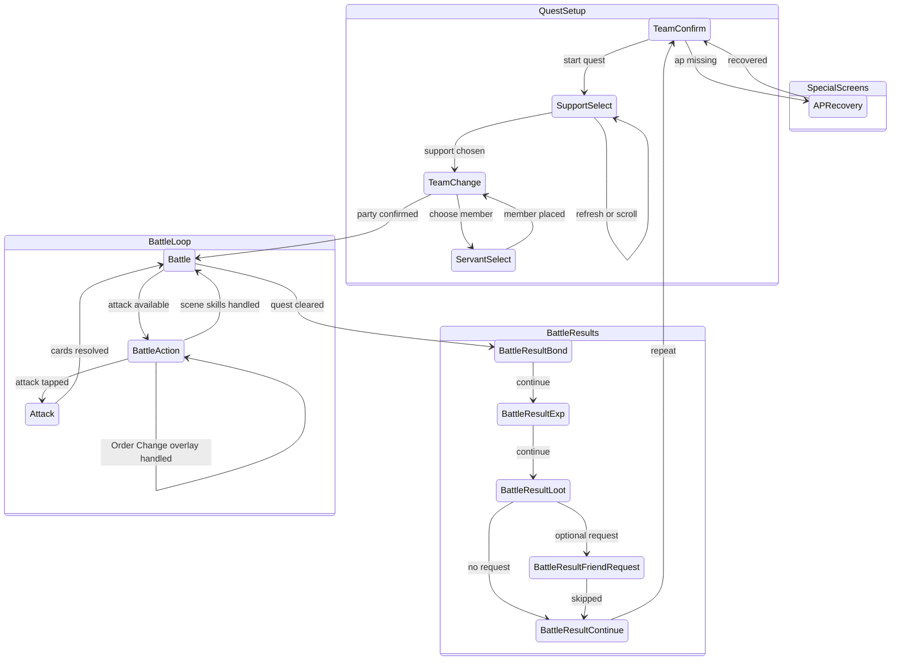

# Battle Automation Screen Relationships

This diagram tracks the battle screen relationship model implemented by
`src-tauri/src/runner.rs`. Screen identity comes from `SidecarClient::detect`,
which is backed by `src-tauri/resources/servers/<server>/cv.json`.

## Template Probes

Battle-specific template probes live in `cv.json` under
their real screens:

- `Battle.variants.main.elements.attack_button`: determines when the battle
  screen is actionable status.
- `SupportSelect.variants.main.elements.support_scroll_end`: detects the bottom
  of the support list.
- `SupportSelect.variants.refreshConfirm.detect` / `.elements.dialog_refresh_support`:
  detects the JP refresh-confirm modal that appears after tapping the support
  refresh button; the runner confirms it, then waits for the modal to vanish
  before resuming OCR/scroll.
- `Battle.variants.main.elements.battle_scene_anchor`: exposes the
  `text_battle_label` region to debug; full
  `BATTLE m/n` reading still uses `read_battle_scene`.

## Support OCR Names

Support selection loads the target servant metadata through
`load_servant_metadata` before calling sidecar `find_supports`. On the CN
server, Rust translates Atlas JP servant and Noble Phantasm names with
`src-tauri/src/resources/servants.json` so OCR matches the text rendered
by the CN client.

When a servant or NP entry has a non-empty `name_cn_server`, that value is
the OCR match target. `name_cn` remains the fallback. This handles CN
server renames where the in-game support row no longer matches the wiki
Chinese name. The mapper keeps `name_jp == name_cn` entries instead of
treating them as untranslated placeholders, because legitimate names can
be identical across JP/CN and can still be overridden by `name_cn_server`.

The sidecar pairs support rows by layout, not by text alone: the NP match
must be a distinct OCR fragment below the servant-name fragment in the
same row. This prevents servants whose displayed name and NP text are the
same from reusing the name line as a false NP match.

## Support Skill / NP Level Filter (CN)

When the active project sets any of `supportNoblePhantasmLevelMin`,
`supportSkillLevelMins`, or `supportAppendSkillLevelMins`, the runner
runs the OCR'd row through `support_row_matches_level_requirements_with_progress`
before tapping it. The function returns:

- `Pass` — name + NP + every required level meets its threshold.
- `Fail` — at least one level is below the configured minimum (with the
  panel that's currently visible). The runner moves on to the next row.
- `WaitingForPanel` — the visible panel matches its slice of the
  requirements, but the *other* panel (owned vs append) hasn't been
  observed for this candidate yet.

Owned and append skill icons share the same row strip; the game decides
which panel is shown via the skill-display toggle (a 3-state cycle:
fixed owned / fixed append / interval switching). The runner can't tell which mode the
user has the toggle locked into — and fixed modes never auto-flip — so
on `WaitingForPanel` it actively taps `SUPPORT_SKILL_PANEL_TOGGLE_BUTTON`
and re-OCRs after a short settle. `SupportLevelPanelProgress.panel_toggle_taps`
caps this at `SUPPORT_SKILL_PANEL_MAX_TOGGLE_TAPS` per candidate; once
the cap is hit, the runner falls through to the scroll/refresh branch
so a row that genuinely can't be verified doesn't trap the loop. The
counter resets implicitly whenever `support_level_candidate_key`
changes (i.e. when the runner moves to a different row).

## Notes

- `BattleSceneTick` is internal state, not a `Screen` enum variant. It maps the
  latest `BATTLE m/n` read through `tick_scene_state` and gates skill execution.
- `BattleAction` is a documentation-only status node for the actionable battle
  condition where `Battle.variants.main.elements.attack_button` is found.
- In-battle Order Change is stored on an equipment action as
  `orderChange.front` + `orderChange.back`. The runner taps the master skill,
  lets the semi-transparent Battle overlay settle, selects exactly one
  front-line slot (`servant_1..3`) and one back-line slot (`servant_4..6`),
  confirms, then waits for the attack button before continuing. This overlay
  is not the pre-battle `TeamChange` screen and is not detected through the
  `Screen::TeamChange` route.
- `waiting_for_battle` extends Unknown tolerance during loading and long attack
  animations.
- `APRecovery` now anchors on `label_item` and scans the item-column template
  region in priority order instead of tapping fixed rows. Top page scans
  rainbow / gold / silver items; after one downward swipe the runner scans bronze items. A missing
  template match is treated as "insufficient quantity" because the dimmed overlay suppresses
  the template score.
- Updating `Screen`, battle result handling, AP recovery behavior, or
  battle screen variant probes requires updating this document.
