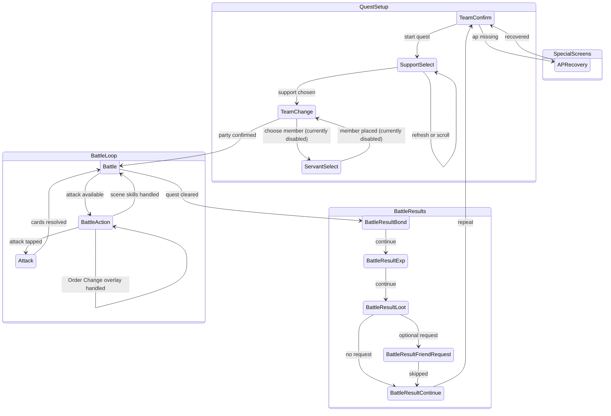

# Battle Automation Screen Relationships

This diagram tracks the battle screen relationship model implemented by
`src-tauri/src/runner.rs`. Screen identity comes from `SidecarClient::detect`,
which is backed by `src-tauri/resources/servers/<server>/cv.json`.

Party servant auto-placement is intentionally disabled for now. The runner
still accepts `servantSelections` in `RunConfig`, but `TeamConfirm` ignores
them until that feature is adapted; it proceeds directly to starting the
quest once the support and existing team state are ready.

## Template Probes

Battle-specific template probes live in `cv.json` under
their real screens:

- `Battle.variants.main.elements.attack_button`: determines when the battle
  screen is actionable status.
- `SupportSelect.variants.main.elements.support_scroll_end`: detects the bottom
  of the support list.
- `SupportSelect.variants.main.elements.grand_servant_support_bottom_line`:
  CN-only status probe for Grand support lists. Grand servants are ordered
  before ordinary servants; after this avatar-frame marker has been seen in
  the current refreshed list, two consecutive misses mean the runner treats
  the Grand section as exhausted and refreshes instead of scrolling through
  ordinary supports.
- `SupportSelect.variants.refreshConfirm.detect` / `.elements.dialog_refresh_support`:
  detects the JP refresh-confirm modal that appears after tapping the support
  refresh button; the runner confirms it, then waits for the modal to vanish
  before resuming OCR/scroll.
- Support-list scroll distance is adaptive. The sidecar surfaces every visible
  `button_support_form_confirm` anchor in `FindSupportsResult.diagnostics.confirmButtonAnchors`;
  the runner sets the swipe delta to `bottom_anchor.y - top_anchor.y`,
  clamped to `[SUPPORT_SCROLL_MIN_DELTA, SUPPORT_SCROLL_MAX_DELTA]`.
  Because confirm buttons sit at a fixed offset within each row card and
  rows are pitched a constant amount apart, that delta is exactly
  `(N - 1) * row_pitch` for the N visible cards, so the bottom row of the
  previous page lands at the same screen y the top row used to occupy —
  i.e. the old bottom row becomes the new top row. When only a single
  anchor (or no anchors) is visible — rare, usually a one-row list or a
  template/shape detector glitch — the runner falls back to
  `SUPPORT_SCROLL_FALLBACK_DELTA` so it still makes forward progress.
- Support-list scroll gestures go through the pluggable
  **`TouchBackend`** trait (`src-tauri/src/touch/`) rather than calling
  `adb shell input swipe` directly. A plain linear swipe lifts off at
  the average swipe velocity, which Android's `VelocityTracker`
  interprets as a *fling* once it crosses the per-device threshold
  (≈100–300 px/s on most modern devices) — so even when the runner's
  intended Δ was correct, the list kept scrolling after lift-off and
  overshot. Every implementation of `TouchBackend::swipe_with_settle`
  therefore holds contact at the destination long enough that the
  velocity tracker's sliding window sees ~0 px/s right before UP, so
  the system never enters fling mode.

  The backend is selected at runner construction time from the
  `MASH_TOUCH_BACKEND` env var (`auto`, `minitouch`, `adb-input`, or
  `sendevent`). `auto` (default) tries minitouch and silently falls
  back to adb-input on bring-up failure. Concrete backends:
  - **`minitouch`** (`touch/minitouch.rs`). Pushes a bundled native
    binary to `/data/local/tmp/minitouch`, forwards an `adb` port to
    its abstract socket, and streams events over TCP using minitouch's
    `d / m / u / w / c` protocol. Each command is processed in
    <1 ms, so a smooth ~30-MOVE swipe over 600 ms followed by a
    `SUPPORT_SCROLL_SETTLE_MS` hold lands in ~1 s total. Pushed
    binaries live under `src-tauri/resources/minitouch/<abi>/minitouch`;
    see that folder's `README.md` for sourcing instructions. The
    backend's `Drop` impl kills the device-side process and removes
    the port forward when the runner ends.
  - **`adb-input`** (`touch/adb_input.rs`). Wraps the legacy
    `Adb::tap` / `Adb::swipe` / `Adb::swipe_with_settle` paths. The
    last one drives the same DOWN / MOVE / settle / UP shape via
    chained `input motionevent` commands in a single `adb shell`
    invocation; slower (~5 s/scroll at the velocity-bound MOVE pace)
    and choppier (each `input` invocation spawns a fresh JVM, capping
    cadence around 15–20 fps) but works without any bundled native
    binary, so it's the universal fallback.
  - **`sendevent`** (`touch/sendevent.rs`). Raw evdev injection via
    `adb shell sendevent /dev/input/event*`. At bring-up it runs
    `getevent -pl`, parses the dump, picks the first device that
    advertises `ABS_MT_POSITION_X/Y` + `ABS_MT_TRACKING_ID` (i.e. a
    Type B multi-touch screen), and records its coordinate ranges.
    Gestures are emitted as chained `sendevent <type> <code>
    <value>; sleep 0.016; ...` shell scripts in a single `adb shell`
    invocation, so the only ADB overhead per gesture is one
    round-trip; on the device side each `sendevent` is a 1–5 ms
    `open + write + close` on the event node. Comparable smoothness
    to `minitouch` but without needing a pushed native binary —
    handy on cloud / corporate devices where pushing executables
    isn't allowed. Falls back to `adb-input` if `getevent -pl`
    doesn't expose a Type B touchscreen (legacy resistive panels,
    non-evdev touch drivers).

  Each scroll emits a debug-level operation log entry tagged with the
  backend that actually fired
  (`滚动助战列表: 按钮 y=[…] (n=…) Δ=… swipe=…→… (Xms+Yms settle) [minitouch]`),
  so an operator can tell at a glance which gesture path produced the
  scroll they're triaging. Debug-level entries are hidden by default
  behind the status-bar "显示调试" toggle.

## Operation log levels

`AutomationEvent.level` (and the matching `EnhancementAutomationEvent.level`)
classifies each runner status emit as `info` or `debug`. The `Runner::emit`
helper defaults to `info` — the existing user-facing operation log entries
("找到助战 …", "刷新助战列表 …", "{action}失败: …"). `Runner::emit_debug`
sends technical diagnostics (CV anchor positions, swipe distances) that
the frontend filters out of the operation log panel by default. The
status-bar "显示调试" checkbox flips the filter so both levels render —
debug entries are styled dimmer and don't count toward the
"操作日志 (N)" trigger badge. Add new debug-level emits via `emit_debug`
when the message is only useful for triage; reserve `emit` for events
the operator should always see.
- `Battle.variants.main.elements.battle_scene_anchor`: exposes the
  `text_battle_label` region to debug; full
  `BATTLE m/n` reading still uses `read_battle_scene`.
- `BattleResultBond.detect`: detects the normal bond-points label
  (`text_battle_result_bond`). `BattleResultBondLevelUp.detect` uses a
  separate center-dialog region for the bond-level-up overlay label
  (`text_battle_result_bond_level_up`); Rust routes it to the same
  `BattleResultBond` handler.

## Support OCR Names

Support selection loads the target servant metadata through
`load_servant_metadata` before calling sidecar `find_supports`. On the CN
server, Rust translates Atlas JP servant and Noble Phantasm names with
`src-tauri/src/resources/servants.json` so OCR matches the text rendered
by the CN client.

When a servant or NP entry has a non-empty `name_cn_server`, that value is
the OCR match target. `name_cn` remains the fallback. This handles CN
server renames where the in-game support row no longer matches the wiki
Chinese name. The mapper keeps `name_jp == name_cn` entries instead of
treating them as untranslated placeholders, because legitimate names can
be identical across JP/CN and can still be overridden by `name_cn_server`.

The sidecar pairs support rows by layout, not by text alone: the NP match
must be a distinct OCR fragment below the servant-name fragment in the
same row. This prevents servants whose displayed name and NP text are the
same from reusing the name line as a false NP match.

## Support Craft Essence Filter

When a support CE is configured, the runner first matches the row's CE
art against `assets/ces/{id}/card_ce.png`. If the slot's MLB requirement
is enabled (default), the same `verify_support_ce` call also requires
`icon_mlb_mark` in the CE's lower-right area.

Grand support mode replaces the single CE check with three positional CE
checks. Unconfigured Grand slots are skipped. Each configured slot can
require MLB independently. The second Grand slot can additionally require
one of the Grand bond icons: `icon_grand_bond_ce` for the original bond
CE, or `icon_grand_bond_ce_np` for the Grand-linked bond CE. Enabled CE
art and icon checks must all pass before the row can be selected.

On CN Grand support lists, the runner also watches
`grand_servant_support_bottom_line` in the fixed left avatar-frame column.
If no matching support row was selected, the runner first needs to see that
marker in the current refreshed list. Once seen, two consecutive missing
probes mean the remaining visible rows are ordinary supports, so it refreshes
instead of continuing to the scroll-bar bottom. If the marker was never seen,
the runner keeps the older scroll-to-bottom behavior for that refreshed list.
Server bundles without this probe also keep the older scroll-to-bottom
behavior.

## Support Skill / NP Level Filter (CN)

When the active project sets any of `supportNoblePhantasmLevelMin`,
`supportSkillLevelMins`, or `supportAppendSkillLevelMins`, the runner
runs the OCR'd row through `support_row_matches_level_requirements_with_progress`
before tapping it. The function returns:

- `Pass` — name + NP + every required level meets its threshold.
- `Fail` — at least one level is below the configured minimum (with the
  panel that's currently visible). The runner moves on to the next row.
- `WaitingForPanel` — the visible panel matches its slice of the
  requirements, but the *other* panel (owned vs append) hasn't been
  observed for this candidate yet.

Owned and append skill icons share the same row strip; the game decides
which panel is shown via the skill-display toggle (a 3-state cycle:
fixed owned / fixed append / interval switching). The runner can't tell which mode the
user has the toggle locked into — and fixed modes never auto-flip — so
on `WaitingForPanel` it actively taps `SUPPORT_SKILL_PANEL_TOGGLE_BUTTON`
and re-OCRs after a short settle. `SupportLevelPanelProgress.panel_toggle_taps`
caps this at `SUPPORT_SKILL_PANEL_MAX_TOGGLE_TAPS` per candidate; once
the cap is hit, the runner falls through to the scroll/refresh branch
so a row that genuinely can't be verified doesn't trap the loop. The
counter resets implicitly whenever `support_level_candidate_key`
changes (i.e. when the runner moves to a different row).

## Notes

- `BattleSceneTick` is internal state, not a `Screen` enum variant. It maps the
  latest `BATTLE m/n` read through `tick_scene_state` and gates skill execution.
- `BattleAction` is a documentation-only status node for the actionable battle
  condition where `Battle.variants.main.elements.attack_button` is found.
- `BattleResultBond` covers ordinary bond-points settlement. The separate
  `BattleResultBondLevelUp` CV screen covers the bond-level-up overlay and
  routes to the same next-button tap target.
- In-battle Order Change is stored on an equipment action as
  `orderChange.front` + `orderChange.back`. The runner taps the master skill,
  lets the semi-transparent Battle overlay settle, selects exactly one
  front-line slot (`servant_1..3`) and one back-line slot (`servant_4..6`),
  confirms, then waits for the attack button before continuing. This overlay
  is not the pre-battle `TeamChange` screen and is not detected through the
  `Screen::TeamChange` route.
- Advanced-mode teams store battle scenes in `advanced_battle_scenes.json`.
  The current strategy UI uses a three-stage flow. First, the runner enters
  the attack-card screen and treats the scene as "waiting for startup": it
  checks the configured five command-card startup conditions, unless the scene
  enables Grand auto Order Change as its startup condition. In that Grand mode,
  the runner counts the current front line's recognized command cards, chooses
  the front servant with the highest count (leftmost on ties), uses Mystic Code
  `skill_3` to swap that servant with the back-line main Grand servant, then
  treats startup as satisfied. It still executes the current turn's next
  `controlActions` entry before `startupActions`, so the first post-swap turn
  consumes the same per-turn control slot as ordinary startup matching. Those
  actions are resolved by the originally selected servant identity: a configured
  back-line main Grand action is rewritten to its current front-line slot, while
  an action whose selected servant was moved to the back line is skipped. If ordinary
  command-card startup conditions do not match, it optionally taps the
  bottom-right attack-screen return button and executes one `controlActions` entry per
  turn in configured order, then re-enters the attack-card screen and attacks
  with the automatic priority strategy while passing an empty NP list so no
  Noble Phantasm is released. Once all control actions have been consumed,
  later non-matching turns keep using the same no-NP automatic attack. When
  the startup condition matches, the runner taps the bottom-right return button,
  executes `startupActions`, reapplies explicit Order Change effects to the
  active front-line id map, then re-enters the attack-card screen. From that
  point the scene is in automatic battle mode. In ordinary advanced scenes,
  ready NPs and command cards are scored together with the configured
  main-output servant, output type, and NP color (`npCard`, or the servant
  resource's `noblePhantasmCard` when set to automatic). In Grand battle mode,
  the project stores one or two `grandServants`; the first is the main output
  and the second is the deputy. The automatic picker prefers main-servant
  three-card chains first, then deputy chains, with exquisite B/A/Q chains
  ahead of same-color force/quick/skill chains and ordinary brave chains.
  Same-color chains that include the main output outrank same-color chains
  that include the deputy. Exquisite damage-priority chains place the target
  NP last; NP-priority chains place a red command card before a non-red target
  NP when available. Same-color chains with a target NP place the NP first
  because command-card position performance does not apply to NPs. If no chain
  is available, the picker can place deputy or auxiliary ready NPs before the
  target NP for overcharge, then keeps output servant command cards later so
  they receive the second/third-card performance bonus. Legacy advanced `rules`
  are still supported: when a scene has rule entries, the older rule evaluator
  runs instead of the three-stage strategy flow.
- `waiting_for_battle` extends Unknown tolerance during loading and long attack
  animations.
- `APRecovery` now anchors on `label_item` and scans the item-column template
  region in priority order instead of tapping fixed rows. Top page scans
  rainbow / gold / silver items; after one downward swipe the runner scans bronze items. A missing
  template match is treated as "insufficient quantity" because the dimmed overlay suppresses
  the template score.
- Updating `Screen`, battle result handling, AP recovery behavior, or
  battle screen variant probes requires updating this document.
