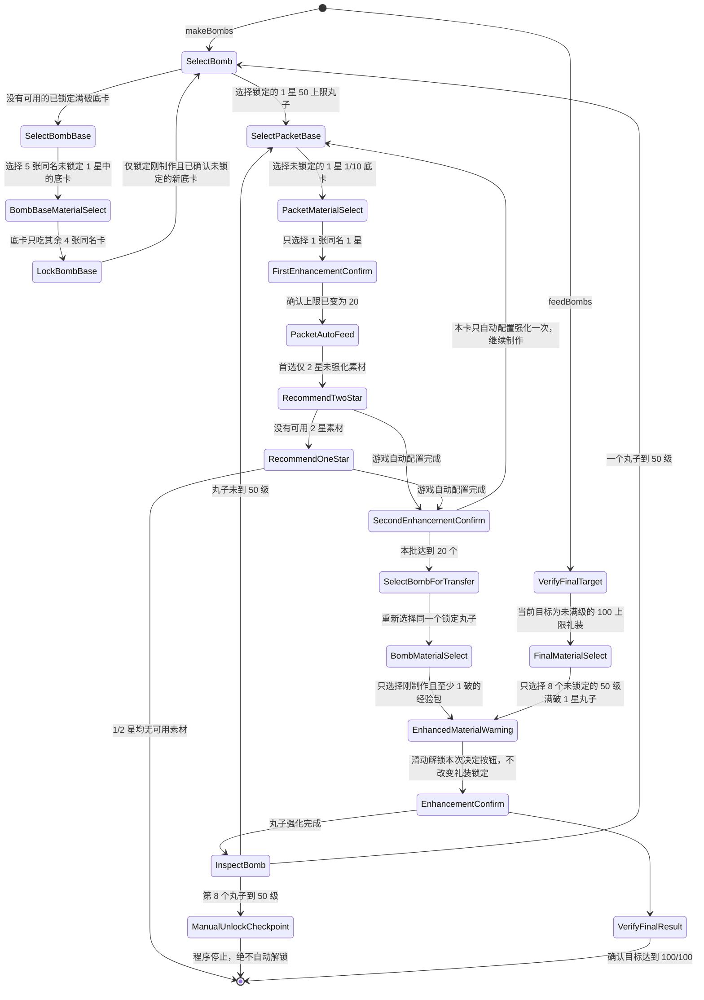

# 概念礼装丸子自动化

本流程由独立的 `craft_essence_enhancement_runner` 驱动，当前仅支持国服。它不依赖从者强化 runner；两者只共享 ADB、视频流、识图和运行互斥基础设施。

页面提供两个独立阶段：

1. `makeBombs`：优先使用已锁定、满破、未满 50 级的 1 星礼装；不足时用 5 张同名 1 星制作并安全锁定新底卡，直到得到 8 个 50 级丸子。
2. `feedBombs`：用户仅手动解锁这 8 个丸子并选择目标满破 5 星礼装后，将丸子喂给目标并确认达到 100 级。

自动化永远不会执行解锁操作。

## 礼装网格识别

- 网格仍以 `item_ce_bar_bronze` 为锚点，一屏最多读取 21 张完整卡片；没有对应锚点的底部空槽，以及只露出底栏或半张卡面的滚动残片都会被丢弃。
- 每张卡片独立读取右上角 `当前等级/等级上限`，并识别左侧小锁。
- 1 星等级上限为 `10/20/30/40/50`，2 星为 `15/25/35/45/55`；因此等级上限同时确定星级和 0～4 次突破。最终目标只额外接受 `100` 上限。
- 卡面中部生成感知指纹，用于重新查找刚制作的经验包和丸子；素材页只有在卡片中央 OCR 明确读到“突破极限”且黄色标记占比同时达标时，才确认与当前底卡同名，避免黄色卡面误命中。
- 锁模板分数不低于 `0.70` 才视为已锁定，不高于 `0.50` 才视为未锁定；中间区间属于不明确。等级小字的备用读取会放大后复核。
- 单帧出现无法明确识别的完整卡片时不点击卡片，原地重试；连续 3 次仍失败才停止。

## 丸子选择

- 只选择 `锁定 + 1 星 + 50 上限 + 4 次突破 + 当前等级小于 50` 的丸子。
- 同一页有多个候选时优先选择等级最高者，减少中途切换次数。
- 启动时会先计入当前页已有的锁定 `50/50` 丸子，支持中断后继续补足。
- 已满 50 级、未锁定、2 星或上限不符的卡片都不能成为丸子目标。
- 已有锁定底卡不足时，只选择当前页至少有 5 张同卡面副本的未锁定 `1/10` 礼装：1 张做底卡，另外 4 张作为素材，得到满破 `50` 上限底卡。
- 新底卡返回列表后必须再次匹配未锁定、1 星、50 上限、4 次突破和卡面指纹，才允许进入统一锁定模式。
- 进入统一锁定模式后只点击刚才记录的卡位；出现锁图标后立即切回“选择对象”。如果没有确认锁图标，停止且绝不再次点击，避免延迟响应造成反向解锁。

## 至少 1 破的经验包

- 底卡必须是 `未锁定 + 1 星 + 1/10`，且当前可见列表里至少还有一张同卡面副本。
- 第一次进入素材页时，如果自动配置已有预选内容，先全部清除；随后只选择 1 张同卡面的未锁定 1 星 `1/10`，绝不手动补选其他礼装。
- 同卡面素材以文字与颜色双重确认的“突破极限”标记识别；点击后必须等下一帧页面计数从 `0/20` 变为 `1/20`，才允许决定并执行第一次强化。
- 第一次强化返回后必须重新读取目标等级上限。只有确认上限已从 `10` 变为 `20`，才进入自动配置阶段；仍为 `10` 或其他上限时立即停止。
- 自动配置先严格设为“仅 2 星 + 未强化”，并确保 1/3/4/5 星和已强化均关闭。配置状态可以复用，但每张 1 破经验包都必须重新打开推荐选择并点击一次“执行”；只有本张执行二星推荐后强化按钮仍不可用，才把配置持久切换为“仅 1 星 + 未强化”。
- 游戏完成自动配置后直接点击强化，不再进入素材页逐张选择。每张经验包只执行一次这类自动配置强化；这一轮如果又吃到同名一星、把上限推到 `30/40/50` 也属于合法产物。第二次强化返回并确认上限属于 `20/30/40/50` 后立即登记，绝不对同一张执行第二轮自动配置。
- 推荐选择出现“未发现符合条件的概念礼装”时，才把当前稀有度判为耗尽：二星耗尽后关闭提示并改配一星；仅一星也出现同一提示时，视为 1/2 星素材均无法继续使用，正常结束丸子制作。
- 若当前等级字符识别不完整，仅允许使用等级 ROI 内唯一、严格匹配白名单的 `/20` 上限证据，绝不据此猜测当前等级。
- 素材不足时按整页距离向下滑动继续寻找；最多扫描 12 页，仍不足则停止。
- 连续制作一批经验包；单批最多 20 个。底卡不足但本批已有经验包时，提前结束本批并转移给丸子。
- 找不到两张同名 `1/10` 底卡时不终止：若本次进程没有刚登记的批次，当前强化目标仍是已校验的锁定丸子，因此直接关闭目标列表返回主页面，不再按卡面指纹重复选择；随后扫描库存中所有 `未锁定 + 已升级 + 1 星 + 20/30/40/50 上限` 的礼装。原始 `1/10`、2 星和任何锁定礼装仍不会进入该恢复批次。

## 向丸子转移经验

- 重新选择丸子时必须同时匹配锁定、1 星、50 上限、卡面指纹和不低于上次记录的等级。
- 丸子的素材只允许 `未锁定 + 1 星 + 20/30/40/50 上限 + 对应 1～4 次突破`，且卡面指纹必须逐一匹配本批刚制作的经验包。
- 一次喂掉整批经验包，最多 20 个；若丸子提前达到等级上限，则保留未用经验包。强化返回后重新读取丸子等级；未到 50 级就制作下一批。
- 库存恢复批次不足 20 张时，在 `ui_scroll_bar_end.png` 确认到底后按页面实际已选数量提交；若一张合格经验包也没有，才以“一星和二星素材均已消耗完”正常结束。

## 最终五星强化

- 用户必须先手动解锁刚完成的 8 个丸子，并在游戏里选择目标 5 星礼装。
- `feedBombs` 启动后先读取主页面等级；只有 `当前等级/100` 才允许打开素材页。
- 最终素材只允许 `未锁定 + 1 星 + 50/50 + 4 次突破`，必须找到 8 张。
- 强化结束后再次读取主页面，只有 `100/100` 才报告完成。

## 通用画面和交互约束

- 主页面必须同时命中 `icon_enhancement_result` 和 `element_enhancement_ce_stripe`。
- 目标/素材列表必须命中 `button_enhancement_ce_select_ce_mark`；`button_enhancement_ce_clean_all_select*` 区分素材列表。刚切页时若页面信号与策略阶段冲突，只等待后续帧复核，不点击卡片。
- 每次进入手动素材列表都读取游戏显示的 `已选中 N/20`。若程序尚未选卡但自动配置已经预选素材，先全部清除并确认回到 `0/20`；后续页面计数与程序记录不一致时立即停止，点击决定前还必须再次确认数量完全相等。经验包第二次强化不进入该页面，而是只接受游戏自动配置后的主页面就绪状态。
- 同一屏里已经完成安全识别的素材会连续点击，并在下一帧统一核对游戏 `N/20`，避免每张卡都重复执行页面分类、计数 OCR 和整页网格识别；只有“先吃一张同名礼装”的阶段始终限制为单张点击。
- 批量喂入已经强化过的经验包或丸子时，游戏会先显示“强化用素材的灵基确认”。程序只在本批素材已安全提交的阶段滑动并解锁本次“决定”按钮；这不会改变任何礼装的锁定状态。
- 每次点击强化确认时记录唯一的待结算策略阶段。返回后先读取主目标并验证上限：满破底卡和丸子转移必须为 `50`、经验包第一次同名强化必须为 `20`、经验包唯一一次自动配置强化接受 `20/30/40/50`、最终五星必须为 `100`；只有验证通过才消费该记录并推进一次。已经结算后的残留确认框或成功画面不会再次触发结算。
- 列表密度必须切到 `button_scale_level_3`。
- 手动列表筛选先初始化。选择丸子、底卡和同名副本时只开启 1 星；3/4/5 星始终关闭。
- 排序始终设为等级顺序并开启智能排序：选择丸子目标时使用降序，选择底卡及任何强化素材时使用升序。两类列表都必须在筛选和排序确认后先复位滚动条到顶部并验证成功，才允许读取或点击卡片。
- 游戏切换排序或筛选后可能保留滚动位置，因此每轮查找先识别右侧滚动条，将滑块向轨道顶部上方过拖，并在下一帧严格确认滑块上沿已进入顶部范围；无法确认真正到顶时停止，不读取被裁切的第一行。
- 每次准备继续向下翻页前使用共享 `ui_scroll_bar_end.png` 检测礼装列表底端；命中后立即按当前阶段结算“已穷尽”，不再对停在底部的列表重复滑动。12 页上限只作为模板暂时漏检时的保底。
- 所有点击和滑动在物理坐标层加入 ±6px 抖动。
- 推荐选择只允许出现在经验包的第二次强化阶段；程序逐项确认仅目标低星稀有度和“未强化”开启，并确保自动配置开启。其他策略阶段意外进入该对话框时立即停止。
- 除了“刚制作的新底卡已在普通模式确认未锁定”这一受控阶段，如果列表处于“统一锁定/锁定解除”操作模式，立即停止并提示切回“选择对象”，不会点击任何卡片。
