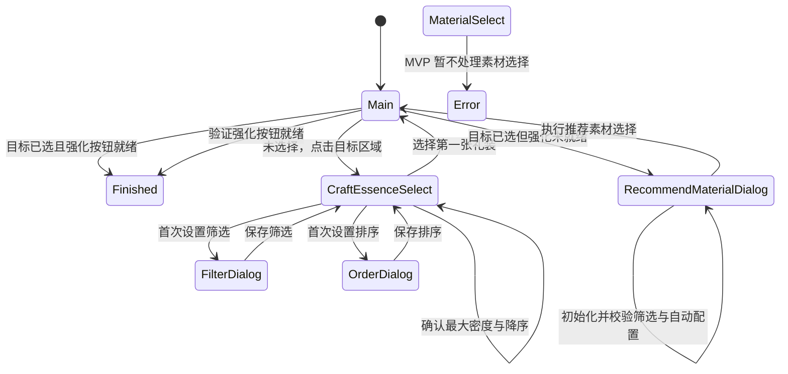

# 概念礼装强化自动化画面关系

本流程由独立的 `craft_essence_enhancement_runner` 驱动，当前仅支持国服。它不依赖从者强化 runner；两者只共享 ADB、视频流、识图和运行互斥基础设施。

## 画面分类

- 主页面必须同时命中 `icon_enhancement_result` 和 `element_enhancement_ce_stripe`。
- 主页面内，`element_enhancement_new` 表示未选择目标；缺失时表示已选择。`button_enhancement_ready` 只记录就绪状态。
- 选择列表必须命中 `button_enhancement_ce_select_ce_mark`。任一 `button_enhancement_ce_clean_all_select*` 存在时为素材选择，否则为目标礼装选择。
- 筛选和排序弹窗是目标礼装选择页的状态，分别由 `dialog_enhancement_ce_filter` 和 `dialog_enhancement_ce_order` 识别。
- 推荐素材弹窗仍属于概念礼装强化主页面，由国服模板 `dialog_enhancement_ce_recommend_material` 识别。

## 首次选择设置

- 列表密度必须命中礼装专用 `button_scale_level_3`，最多循环点击三次。
- 筛选先恢复初始设置，再确保五星、四星、三星为 off，二星、一星为 on。开关在指定 ROI 内按颜色亮度识别：平均亮度不高于 145 为蓝色 off，不低于 180 为白色 on，中间值视为不明确并停止。
- 排序设置为等级顺序并开启智能排序；返回列表后确保降序模板可见。
- 使用 `item_ce_bar_bronze` 作为通用物品网格锚点，按行列顺序点击第一格。

## 推荐强化素材

- 目标礼装已选但 `button_enhancement_ready` 未命中时，点击主页面右上的推荐选择按钮。
- 推荐素材弹窗先点击初始化；种类不检查，只确保 1 星、2 星、未强化为白色选中，3/4/5 星、已强化为蓝色未选。
- 白色/蓝色按钮沿用亮度判断：平均亮度不低于 180 为选中，不高于 145 为未选，中间值停止。
- 自动配置开关按颜色饱和度判断：不高于 70 为关闭，不低于 110 为开启，中间值停止。确认开启后点击执行。
- 执行后必须返回主页面并命中 `button_enhancement_ready` 才进入 `Finished`；不会点击强化按钮。

所有新增 1920 基准模板在 `cv.json` 中声明 `templateReferenceWidth: 1920`。每次点击在物理坐标层加入 ±6px 抖动。
