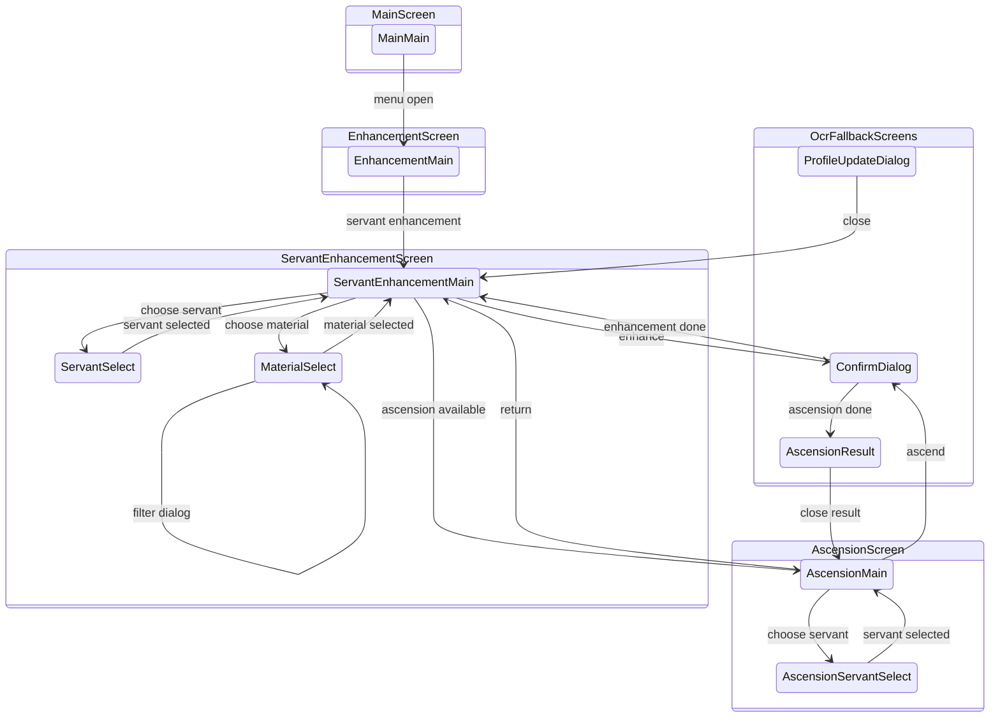

# Enhancement Automation Screen Relationships

This diagram tracks the enhancement screen and variant relationship model
implemented by `src-tauri/src/enhancement_runner.rs`. Screen routing is
template-first and uses each screen's `detect` and `variants` entries from
`src-tauri/resources/servers/<server>/cv.json`.

## Template Probes

Enhancement-specific probes live in `cv.json` under
their real screens and variants.

Screen anchors:

- `Main.detect`: `button_notification`.
- `Enhancement.detect`: `text_enhancement`.
- `ServantEnhancement.detect`: `text_enhancement_servant`.
- `Ascension.detect`: `screen_enhancement_ascension`.

Variant detects and status elements:

- `Main.variants.main.elements.button_enhancement`: menu-open status and
  enhancement action.
- `Main.variants.main.elements.button_menu`: menu button for collapsed status.
- `ServantEnhancement.variants.main.detect`: `text_enhancement_result`.
- `ServantEnhancement.variants.servantSelect.detect`:
  `text_enhancement_servant_select`.
- `ServantEnhancement.variants.materialSelect.detect`:
  `text_enhancement_material`.
- `ServantEnhancement.variants.materialSelect.elements.dialog_filter_setting`:
  `dialog_filter_setting`.
- `Ascension.variants.main.detect`: `text_ascension_main_variant`.
- `Ascension.variants.servantSelect.detect`:
  `text_enhancement_ascension_servant_select`.
- `Ascension.variants.main.elements.enhancement_ascension_not_ready`:
  not-ready status.
- `ServantEnhancement.variants.servantSelect.elements.button_scale_level_3`
  and material or ascension select equivalents: maximum list density status.

## Notes

- Level and selected material count still use OCR.
- Hot OCR paths are bounded to narrow purpose-specific regions: dialog
  classification reads the central dialog text area, and servant enhancement
  reads only the ascension-entry button area after level digits indicate a
  max-level servant.
- Confirm dialogs, profile update dialogs, and ascension result fallback still
  use OCR until dedicated templates are added.
- Updating `EnhancementScreen`, `EnhancementTopScreen`, `EnhancementVariant`,
  `EnhancementStatus`, or enhancement screen variant/status probes requires
  updating this document.
