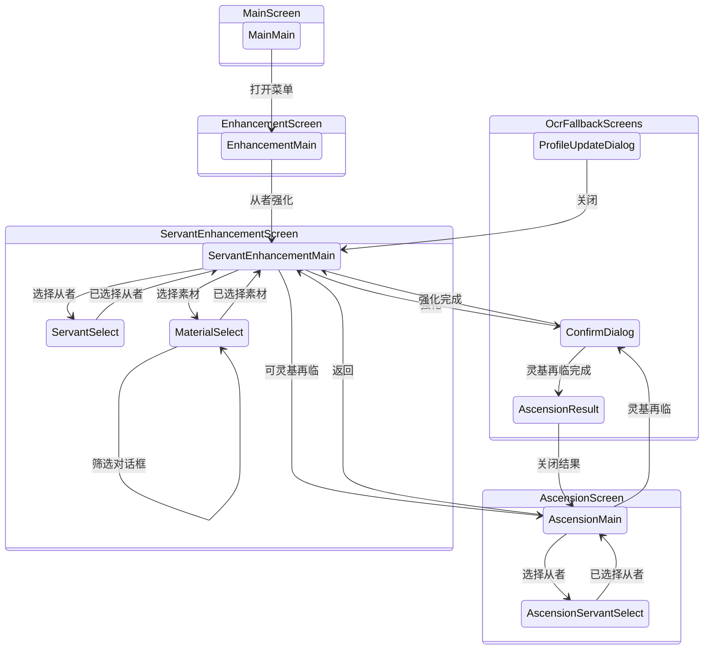

# 强化自动化画面关系

本图描述 `src-tauri/src/enhancement_runner.rs` facade 与 `src-tauri/src/enhancement_runner/` 子模块实现的强化画面及 variant 关系；Tauri lifecycle command 位于 `src-tauri/src/commands/automation/enhancement.rs`。画面路由采用 template-first 方式，使用 `src-tauri/resources/servers/<server>/cv.json` 中各 screen 的 `detect` 和 `variants` 配置。

## 模板 Probe

强化专用 probe 位于 `cv.json` 中对应的 screen 和 variant 下。

Screen anchor：

- `Main.detect`：`button_notification`。
- `Enhancement.detect`：`text_enhancement`。
- `ServantEnhancement.detect`：`text_enhancement_servant`。
- `Ascension.detect`：`screen_enhancement_ascension`。

Variant detection 与 status element：

- `Main.variants.main.elements.button_enhancement`：menu-open status 与强化 action。
- `Main.variants.main.elements.button_menu`：collapsed status 的菜单按钮。
- `ServantEnhancement.variants.main.detect`：`text_enhancement_result`。
- `ServantEnhancement.variants.servantSelect.detect`：`text_enhancement_servant_select`。
- `ServantEnhancement.variants.materialSelect.detect`：`text_enhancement_material`。
- `ServantEnhancement.variants.materialSelect.elements.dialog_filter_setting`：`dialog_filter_setting`。
- `Ascension.variants.main.detect`：`text_ascension_main_variant`。
- `Ascension.variants.servantSelect.detect`：`text_enhancement_ascension_servant_select`。
- `Ascension.variants.main.elements.enhancement_ascension_not_ready`：not-ready status。
- `ServantEnhancement.variants.servantSelect.elements.button_scale_level_3` 以及素材／灵基再临选择页面的同类元素：最大列表密度 status。

## Runner 生命周期状态机

对外可见的强化自动化生命周期仍由 `EnhancementRunnerState`（`Idle`、`Starting`、`Running`、`Finished`、`Error`）序列化。运行时变化通过 `EnhancementLifecycleEvent` 与 `enhancement_lifecycle_transition` 进入：

- `Starting + WorkerStarted -> Running`
- `Starting|Running + StopRequested -> Idle`
- `Running + Finished -> Finished`
- `* + Failed(message) -> Error(message)`

无效的 lifecycle event 会保持当前状态不变。启动 command 在 worker thread 创建前生成初始 `Starting` 状态；worker 代码与启动失败路径随后使用 lifecycle event。该约定由 `src-tauri/src/enhancement_runner/tests.rs` 的 `enhancement_lifecycle_*` 测试覆盖。

## 说明

- `EnhancementAutomationEvent.status` 是面向前端的生命周期状态：`idle`、`starting`、`running`、`finished` 或 `error`；`state` 调试字符串仍会输出供诊断使用。
- 等级与已选素材数量仍通过 OCR 读取。
- 高频 OCR 路径被限制在用途明确的窄区域：对话框分类读取中间的对话框文字区域；从者强化会在等级数字表明从者满级后，仅读取灵基再临入口按钮区域。
- 确认对话框、资料更新对话框和灵基再临结果 fallback 仍使用 OCR，直至加入专用模板。
- 若要完全移除 OCR/fallback，仍需以下模板占位：强化／灵基再临二次确认对话框唯一模板、资料更新对话框唯一模板、完整灵基再临结果返回状态模板、已选素材数量模板，以及可证明 EXP 选项启用而相邻筛选项未启用的三态 EXP 筛选确认模板。
- 修改 `EnhancementScreen`、`EnhancementTopScreen`、`EnhancementVariant`、`EnhancementStatus` 或强化画面的 variant/status probe 时，必须同步更新本文档。
