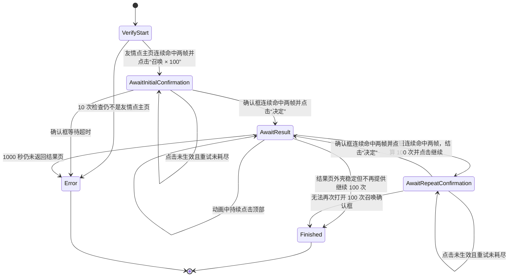

# 友情点抽取自动化

友情点抽取由独立的 `friend_point_summon_runner` 驱动，当前仅支持国服。它与战斗、从者强化和概念礼装强化 runner 互斥，只共享 ADB、视频流、触控和 CV sidecar 基础设施。

## 页面和安全约束

- 启动时必须连续两帧命中 `text_grand_summon_friends_point`。结果页、确认框、其他灵基召唤页面均不能作为启动入口。
- “召唤 × 100”的点击区域为 `x=0.678, y=0.711, w=0.013, h=0.019`，实际点击中心为 `(0.6845, 0.7205)`。
- 只有连续两帧命中 `dialog_grand_summon_friends_point_confirmation` 后，才允许点击“决定”。
- “决定”的点击区域为 `x=0.654, y=0.775, w=0.014, h=0.022`，实际点击中心为 `(0.661, 0.786)`。
- 动画阶段每 400ms 检查一次页面，每 1000ms 点击一次顶部 `(0.685, 0.095)`，最长等待 1000 秒，以覆盖首次获得从者时的长动画。
- 只有结果页连续两帧命中 `button_grand_summon_friends_point_continue_100`，或结果页外壳稳定但该按钮持续缺失时，才把待结算批次记为完成 100 次。
- 继续按钮使用模板匹配中心点击，不使用固定坐标。
- 所有点击在物理坐标层加入 ±6px 抖动。
- 任一点击最多重试 3 次；无法解释的页面或超时会停止，不盲点恢复。

## CV 配置

四个模板均来自 1920×1080 截图，必须设置 `templateReferenceWidth: 1920`。搜索区域严格使用资源提取记录中的 `paddedRoi`：

| 元素 | paddedRoi |
| --- | --- |
| `screen_grand_summon` | `0.802, 0, 0.198, 0.107` |
| `text_grand_summon_friends_point` | `0.403, 0.482, 0.196, 0.135` |
| `dialog_grand_summon_friends_point_confirmation` | `0.418, 0.237, 0.136, 0.087` |
| `button_grand_summon_friends_point_continue_100` | `0.5, 0.889, 0.194, 0.091` |

`screen_grand_summon` 只辅助确认动画已经返回召唤页面外壳，不能授权首次点击。

## 状态机



确认框的识别优先级最高，其次是精确的“继续进行100次召唤”按钮、友情点主页文字和灵基召唤页面外壳。这样即使弹窗背后的主页或结果页模板仍有残留分数，也不会绕过二次友情点校验。

## 生命周期和事件

外部生命周期为：

```text
Idle -> Starting -> Running -> Finished
                           \-> Error
Starting/Running -> Idle（用户停止）
```

事件名为 `friend-point-summon-automation-status`，包含：

- `status`
- `currentScreen`
- `message`
- `completedBatches`
- `summonedCount`

批次和次数由 Rust runner 维护，前端只负责展示。
